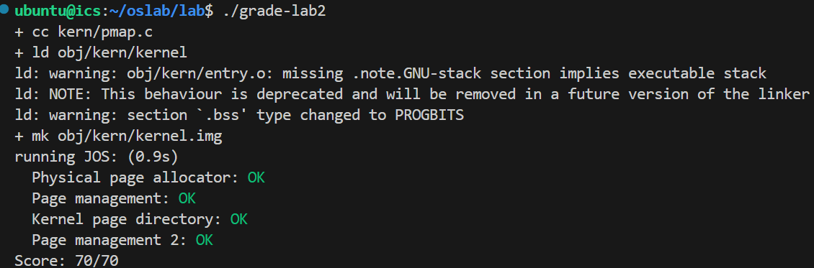

# Lab2 Report
## Part 1: Physical Page Management
keep track of which parts of physical RAM are free and which are currently in use
page granularity 
write the physical page allocator
a linked list of struct PageInfo objects, each corresponding to a physical page
#### Exersice 1
In the file `kern/pmap.c`, you must implement code for the following functions (probably in the order given).

```c
boot_alloc()
mem_init() (only up to the call to check_page_free_list(1))
page_init()
page_alloc()
page_free()
```

`check_page_free_list()` and `check_page_alloc()` test your physical page allocator. You should boot JOS and see whether `check_page_alloc()` reports success. Fix your code so that it passes. You may find it helpful to add your own `assert()`s to verify that your assumptions are correct.

`kernel`启动后首先调用`i386_init(void)`，后者又调用`mem_init()`

这是内核初始化时分页机制启动前的准备工作：
```c
// 检测内存
i386_detect_memory();

// 分配页目录，初始化为0
// 可见boot_alloc是boot阶段（分页机制建立之前）的内存分配接口
kern_pgdir = (pde_t *) boot_alloc(PGSIZE);
memset(kern_pgdir, 0, PGSIZE);

// 将页目录作为页表插入页目录本身中
kern_pgdir[PDX(UVPT)] = PADDR(kern_pgdir) | PTE_U | PTE_P;

// TODO: 初始化每个页的PageInfo数据结构

// 建立空闲页列表
page_init();
```

##### `boot_alloc()`
1. `n>0`时分配连续的可容纳`n`字节的物理内存，返回虚拟地址
2. `n==0`时返回下一个空闲页的虚拟地址

`end`链接器分配给内核的`BSS`之后的第一个未被占用的地址，用它作为引导时分配自由内存的起点

```c
result = nextfree; // 1. 空闲内存的地址
nextfree += ROUNDUP(n, PGSIZE); // 2. 更新nextfree指针
if ((uint32_t)nextfree >= KERNBASE + npages * PGSIZE)
	panic("boot_alloc: out of memory\n"); // 3. out of memory
return result;
```

##### `mem_init()`

```c
// TODO: 初始化每个页的PageInfo数据结构
// 1. 分配npages个数据结构的空间
pages = (struct PageInfo *) boot_alloc(npages * sizeof(struct PageInfo));
// 2. 初始化为0
memset(pages, 0, npages * sizeof(struct PageInfo));
```

##### `page_init()`
示例代码先把所有物理页标记为空闲的，但实际上不是，我们先看看`PageInfo`结构到底是什么：
```c
struct PageInfo {
	// 指向下一个空闲页
	struct PageInfo *pp_link;
    // 被分配的次数
	uint16_t pp_ref;
};
```

下面更改`page_init()`中设置数据结构的循环，来设置一些非空闲的页：
```c
for (i = 0; i < npages; i++) {
	if (i == 0) { // page 0
		pages[i].pp_ref = 1;
		pages[i].pp_link = NULL;
	} else if (i >= (size_t)IOPHYSMEM / PGSIZE && i < (size_t)EXTPHYSMEM / PGSIZE) { // IO hole
		pages[i].pp_ref = 1;
		pages[i].pp_link = NULL;
	} else if (i >= (size_t)EXTPHYSMEM / PGSIZE && i < PADDR((boot_alloc(0))) / PGSIZE) { // kernel and data structures, PADDR turns to physical addr
		pages[i].pp_ref = 1;
		pages[i].pp_link = NULL;
	} else {
		pages[i].pp_ref = 0;
		pages[i].pp_link = page_free_list;
		page_free_list = &pages[i]; 
        // page_free_list -> pages[npages-1] -> ... -> 
        // pages[boot_alloc(0)/PGSIZE] -> 
        // pages[IOPHYSMEM/PGSIZE-1] -> 
        // pages[1] -> NULL
	}
}
```
##### `page_alloc()`

`page2kva`函数可以将`PageInfo`对象转化成对应内存页的物理地址，从而使用`memset`函数清零
```c
struct PageInfo *
page_alloc(int alloc_flags)
{
	// Fill this function in
	// 空闲页指针指向NULL，out of memory
	if (page_free_list == NULL)
		return NULL;
	struct PageInfo *pp = page_free_list;
	page_free_list = pp->pp_link; // 更新空闲指针指向下一页
	pp->pp_link = NULL; // 避免double-free，只有NULL时允许free
	if (alloc_flags & ALLOC_ZERO) { // 清零
		memset(page2kva(pp), 0, PGSIZE);
	}
	return pp; //返回分配的页
}
```

##### `page_free()`

```c
void
page_free(struct PageInfo *pp)
{
	// Fill this function in
	// Hint: You may want to panic if pp->pp_ref is nonzero or
	// pp->pp_link is not NULL.
	if (pp->pp_ref != 0)
		panic("page_free: pp_ref != 0");
	if (pp->pp_link != NULL) 
		panic("page_free: double free");
	pp->pp_link = page_free_list; 
	page_free_list = pp;
}
```

运行`qemu`输出：
```bash
check_page_free_list() succeeded!
check_page_alloc() succeeded!
```

#### Exercise 2
[Intel Manual 5.2 Page Translation](https://web.archive.org/web/20250420225121/https://pdos.csail.mit.edu/6.828/2018/readings/i386/s05_02.htm)

[Intel Manual 6.4 Page Protection](https://web.archive.org/web/20250420225135/https://pdos.csail.mit.edu/6.828/2018/readings/i386/s06_04.htm)

### Virtual, Linear, and Physical Addresses

```
           Selector  +--------------+         +-----------+
          ---------->|              |         |           |
                     | Segmentation |         |  Paging   |
Software             |              |-------->|           |---------->  RAM
            Offset   |  Mechanism   |         | Mechanism |
          ---------->|              |         |           |
                     +--------------+         +-----------+
            Virtual                   Linear                Physical
```

`KADDR(pa)`: add `0xf0000000` to the physical address to find its corresponding virtual address in the remapped region

`PADDR(va)`: subtract `0xf0000000` to turn a virtual address in this region (the region where the kernel was loaded, starting at `0xf0000000`, the very region where we mapped all of physical memory) into a physical address

包括：
- 内核全局变量：如`kern_pgdir`, `pages`, `envs`等
- `boot_alloc()`分配的内存：内核启动期间的动态内存分配
- 内核代码和数据：编译时链接到高地址

1. Lab 1 mapping
```
虚拟地址 0x00000000-0x003FFFFF -> 物理地址 0x00000000-0x003FFFFF (4MB)
虚拟地址 0xF0000000-0xF03FFFFF -> 物理地址 0x00000000-0x003FFFFF (4MB)
```

2. Lab 2 mapping
```
C pointer(Offset) (-> [Segment Translation: Identity Mapping]) -> Linear Addr -> [Page Translation] -> Physical Addr
```

虚拟地址范围|物理地址范围|用途
--- | --- | ---
`0xf0000000-0xf0ffffff`|`0x00000000-0x0fffffff`|前256MB物理内存
...其他区域...|...其他区域...|设备内存、特殊区域


#### Exercise 3
While GDB can only access QEMU's memory by virtual address, it's often useful to be able to inspect physical memory while setting up virtual memory. Review the [QEMU monitor commands](https://web.archive.org/web/20250506120221/https://pdos.csail.mit.edu/6.828/2018/labguide.html#qemu) from the lab tools guide, especially the `xp` command, which lets you inspect physical memory. To access the QEMU monitor, press `Ctrl-a c` in the terminal (the same binding returns to the serial console).

Use the `xp` command in the QEMU monitor and the `x` command in GDB to inspect memory at corresponding physical and virtual addresses and make sure you see the same data.

Our patched version of QEMU provides an `info pg` command that may also prove useful: it shows a compact but detailed representation of the current page tables, including all mapped memory ranges, permissions, and flags. Stock QEMU also provides an `info mem` command that shows an overview of which ranges of virtual addresses are mapped and with what permissions.

`uintptr_t`: opaque virtual addresses

`physaddr_t`: physical addresses

Both these types are really just synonyms for 32-bit integers (`uint32_t`)

##### Question
Assuming that the following JOS kernel code is correct, what type should variable `x` have, `uintptr_t` or `physaddr_t`?
```c
mystery_t x;
char* value = return_a_pointer();
*value = 10;
x = (mystery_t) value;
```
##### Answer
`uintptr_t`
`value`是一个虚拟地址，如果想保存对应的物理地址到`x`，应为`physaddr_t x = PADDR(value);`；现在没有进行地址翻译，所以`x`依旧是虚拟地址

## Part 2: Virtual Memory
### Reference counting
the same physical page -> multiple virtual addresses simultaneously

`pp_ref` field of the `struct PageInfo` corresponding to the physical page

this count goes to zero for a physical page, that page can be freed

`pp_ref` should be incremented as soon as you've done something with the `page_alloc`-returned page (like inserting it into a page table). Sometimes this is handled by other functions (for example, `page_insert`) and sometimes the function calling `page_alloc` must do it directly.

### Page Table Management
#### Exercise 4
In the file `kern/pmap.c`, you must implement code for the following functions.
```c
pgdir_walk()
boot_map_region()
page_lookup()
page_remove()
page_insert()
```
`check_page()`, called from `mem_init()`, tests your page table management routines. You should make sure it reports success before proceeding.

##### `pgdir_walk()`

`pgdir` + `va` -> `PTE`

`va`结构如下：`pgdir`加上`PDX`得到`PDE`，其中的页表地址再加上`PTX`得到`PTE`即可

```c
A linear address 'la' has a three-part structure as follows:
+--------10------+-------10-------+---------12----------+
| Page Directory |   Page Table   | Offset within Page  |
|      Index     |      Index     |                     |
+----------------+----------------+---------------------+
 \--- PDX(la) --/ \--- PTX(la) --/ \---- PGOFF(la) ----/
 \---------- PGNUM(la) ----------/

```

```c
pte_t *
pgdir_walk(pde_t *pgdir, const void *va, int create)
{
	// Fill this function in
	pde_t* pde = &pgdir[PDX(va)]; // pde in the pgdir
	if (*pde & PTE_P) { // page table exists
		// PDE里存储的页表地址是物理地址
		pte_t* pt = (pte_t*) KADDR(PTE_ADDR(*pde)); // page table virtual address
		return &pt[PTX(va)]; // address of the pte
	} else { // page table does not exist
		if (!create)
			return NULL;
		struct PageInfo* pp = page_alloc(ALLOC_ZERO);
		if (pp == NULL) // allocation fails
			return NULL;
		pp->pp_ref++;
		*pde = page2pa(pp) | PTE_P | PTE_W | PTE_U; // present, writable, user
		// pte_t* pt = (pte_t*) KADDR(PTE_ADDR(*pde)); // page table virtual address
		pte_t* pt = (pte_t*) page2kva(pp); // page table virtual address
		return &pt[PTX(va)];
	}
	return NULL;
}
```

##### `boot_map_region()`

对于`[va, va + size)`里的每一页，将物理地址和权限位写入对应的`PTE`，用`pgdir_walk`获得`PTE`

```c
static void
boot_map_region(pde_t *pgdir, uintptr_t va, size_t size, physaddr_t pa, int perm)
{
	// Fill this function in
	pte_t* pte = pgdir_walk(pgdir, (void*)va, true); // va对应的PTE条目
	size_t num_pages = size / PGSIZE;
	for (size_t i = 0; i < num_pages; i++) { //每一页
		if (pte == NULL)
			panic("boot_map_region: pgdir_walk failed\n");
		*pte = pa | perm | PTE_P;
		va += PGSIZE;
		pa += PGSIZE;
		pte = pgdir_walk(pgdir, (void*)va, true);
	}
}
```

##### `page_lookup()`

`pgdir` + `va` -> `Page`

`pa2page`的作用是把一个物理地址映射回对应的`struct PageInfo *`

所以只需要找到虚拟地址对应的物理地址，即`PTE`的前20位即可

用`pgdir_walk`可以找到对应的`PTE`

```c
struct PageInfo *
page_lookup(pde_t *pgdir, void *va, pte_t **pte_store)
{
	// Fill this function in
	pte_t* pte = pgdir_walk(pgdir, va, false);
	if (pte != NULL && (*pte & PTE_P)) { // page is present
		if (pte_store != NULL)
			*pte_store = pte;
		return pa2page(PTE_ADDR(*pte));
	}
	return NULL;
}
```	

##### `page_remove()`
先找到对应的`Page`和`PTE`，然后对应处理：减少引用数；清空条目并刷新`TLB`

```c
void
page_remove(pde_t *pgdir, void *va)
{
	// Fill this function in
	pte_t *pte = NULL;
	struct PageInfo* pp = page_lookup(pgdir, va, &pte);
	if (pp == NULL) // no physical page at that address
		return;
	page_decref(pp);
	*pte = 0; // set PTE to 0
	tlb_invalidate(pgdir, va);

}
```

##### `page_insert()`

`page2pa`找到对应的物理地址，从而修改`PTE`即可，注意一些细节比如先释放原有的`PTE`对应的页，刷新`TLB`

*注意不能颠倒增加引用和释放页面的顺序，考虑前后都映射到同一个物理页的情况*

```c
int
page_insert(pde_t *pgdir, struct PageInfo *pp, void *va, int perm)
{
	// Fill this function in
	physaddr_t pa = page2pa(pp);
	pte_t* pte = pgdir_walk(pgdir, va, true);
	if (pte == NULL) // page table couldn't be allocated
		return -E_NO_MEM;
	pp->pp_ref++; // 要先加引用再释放，考虑映射到同一个物理页的情况
	if ((*pte) & PTE_P) 		
	 	page_remove(pgdir, va); 
	
	*pte = pa | perm | PTE_P;
	// pgdir[PDX(va)] |= perm;
	return 0;
}
```

```
check_page_free_list() succeeded!
check_page_alloc() succeeded!
check_page() succeeded!
```

## Part 3: Kernel Address Space
### Permission and Fault Isolation

details in `inc/memlayout.h`

Addr|Kernel|User|Usage
---|---|---|---
`[ULIM, +\infty)`|rw|--|kernel data
`[UTOP, ULIM)`|r-|r-|expose certain kernel data structures
`[0, UTOP]`|rw|rw|user environment

### Initializing the Kernel Address Space
set up the address space above `UTOP`: the kernel part of the address space

#### Exercise 5
Fill in the missing code in `mem_init()` after the call to `check_page()`.

Your code should now pass the `check_kern_pgdir()` and `check_page_installed_pgdir()` checks.

```c
void
mem_init(void)
{
	uint32_t cr0;
	size_t n;

	i386_detect_memory();

	kern_pgdir = (pde_t *) boot_alloc(PGSIZE);
	memset(kern_pgdir, 0, PGSIZE);

	kern_pgdir[PDX(UVPT)] = PADDR(kern_pgdir) | PTE_U | PTE_P;

	pages = (struct PageInfo *) boot_alloc(npages * sizeof(struct PageInfo));
	memset(pages, 0, npages * sizeof(struct PageInfo));

	page_init();

	check_page_free_list(1);
	check_page_alloc();
	check_page();
	
	// map va UPAGES to pa of pages
	boot_map_region(kern_pgdir, UPAGES, PTSIZE, PADDR(pages), PTE_U);

	// map va [KSTACKTOP-KSTKSIZE, KSTACKTOP) to pa of bootstack
	boot_map_region(kern_pgdir, KSTACKTOP - KSTKSIZE, KSTKSIZE, PADDR(bootstack), PTE_W);

	// map va [KERNBASE, 2^32) to pa of [0, 2^32 - KERNBASE)
	boot_map_region(kern_pgdir, KERNBASE, 0xffffffff - KERNBASE, 0, PTE_W);

	check_kern_pgdir();

	lcr3(PADDR(kern_pgdir));

	check_page_free_list(0);

	cr0 = rcr0();
	cr0 |= CR0_PE|CR0_PG|CR0_AM|CR0_WP|CR0_NE|CR0_MP;
	cr0 &= ~(CR0_TS|CR0_EM);
	lcr0(cr0);

	check_page_installed_pgdir();
}

```
#### Question

2. What entries (rows) in the page directory have been filled in at this point? What addresses do they map and where do they point? In other words, fill out this table as much as possible:

Entry	|Base Virtual Address	|Points to (logically):
---|---|---
0x3bd|0xef400000|kern_pgdir
0x3bc|0xef000000|pages
0x3bf|0xefffffff|bootstack
[0x3c0, 0x3ff]|[0xf0000000, 0xffffffff]|kernel data


Name|Addr|PDX|content
---|--|---|---
UVPT | 0xef400000 | 3bd | PADDR(kern_pgdir)
UPAGES | 0xef000000 | 3bc | PADDR(pages)
KSTACKTOP-1 | 0xefffffff | 3bf | PADDR(bootstack)
[KERNBASE, 2^32) | [0xf0000000, 0xffffffff] | [3c0, 3ff] | kernel data

3. We have placed the kernel and user environment in the same address space. Why will user programs not be able to read or write the kernel's memory? What specific mechanisms protect the kernel memory?

有的页表项条目设置了`PTE_U`，这允许用户访问这个页；没有设置相应权限位的条目阻止了用户的随意读写，保护内核。

4. What is the maximum amount of physical memory that this operating system can support? Why?

32位虚拟地址可以容纳`4GB`物理内存

n_pde * n_pte * n_offset(pgsize)= 2^10 * 2^10 * 2^12= 2^32 Byte = 4GB

硬件检测的物理内存大小`mem_init: npages = 32768`

2^15 * 2^12 = 128MB

故硬件支持`128MB`的物理内存


5. How much space overhead is there for managing memory, if we actually had the maximum amount of physical memory? How is this overhead broken down?

1 * page_directory + 2^10 * page_table + n_pages * sizeod(struct PageInfo) = 4KB + 4MB + 2^15 * 8Byte = 4.25MB

6. Revisit the page table setup in `kern/entry.S` and `kern/entrypgdir.c`. Immediately after we turn on paging, `EIP` is still a low number (a little over `1MB`). At what point do we transition to running at an `EIP` above `KERNBASE`? What makes it possible for us to continue executing at a low `EIP` between when we enable paging and when we begin running at an `EIP` above `KERNBASE`? Why is this transition necessary?

```S
# Now paging is enabled, but we're still running at a low EIP
# (why is this okay?).  Jump up above KERNBASE before entering
# C code.
mov	$relocated, %eax
jmp	*%eax # 这里$relocated就是高地址了，跳转到寄存器%eax中的高地址值
```
`entry_pgdir`将`[0, 4MB)`和`[KERNBASE, KERNBASE + 4MB)`的虚拟地址都映射到了`[0, 4MB)`的物理地址上，所以兼容了内存的不同访问模式：低`EIP`的物理访存和高`EIP`的虚拟访存



## Challenge
### Monitor Extension
Extend the JOS kernel monitor with commands to:

1. Display in a useful and easy-to-read format all of the physical page mappings (or lack thereof) that apply to a particular range of virtual/linear addresses in the currently active address space. For example, you might enter `showmappings 0x3000 0x5000'` to display the physical page mappings and corresponding permission bits that apply to the pages at virtual addresses `0x3000`, `0x4000`, and `0x5000`.

```c
int 
mon_showmappings(int argc, char **argv, struct Trapframe *tf) 
{
    if (argc < 2) {
        cprintf("Usage: %s\n", commands[3].desc);
		return 0;
	}

    uintptr_t vstart, vend;
    pte_t *pte;

    vstart = (uintptr_t)strtol(argv[1], 0, 0);
	vend = (uintptr_t)strtol(argv[2], 0, 0);

    vstart = ROUNDDOWN(vstart, PGSIZE);
    vend = ROUNDDOWN(vend, PGSIZE);

    for(uintptr_t va = vstart; va <= vend; va += PGSIZE) {
        pte = pgdir_walk(kern_pgdir, (void*)va, 0);
        if (pte && *pte & PTE_P) {
            cprintf("VA: 0x%08x, PA: 0x%08x, U-bit: %d, W-bit: %d\n",
            va, PTE_ADDR(*pte), !!(*pte & PTE_U), !!(*pte & PTE_W));
        } else {
            cprintf("VA: 0x%08x, PA: No Mapping\n", va);
        }
    }
    return 0;
}
```

Examples
```
K> showmappings 0x3000 0x5000
VA: 0x00003000, PA: No Mapping
VA: 0x00004000, PA: No Mapping
VA: 0x00005000, PA: No Mapping
K> showmappings 0xf0000000 0xf0001000
VA: 0xf0000000, PA: 0x00000000, U-bit: 0, W-bit: 1
VA: 0xf0001000, PA: 0x00001000, U-bit: 0, W-bit: 1
```

2. Explicitly set, clear, or change the permissions of any mapping in the current address space.
```c
int 
mon_setpermission(int argc, char **argv, struct Trapframe *tf) 
{
    if (argc < 2 || argc > 3) {
        cprintf("%s\n", commands[4].desc);
		return 0;
	}
	uintptr_t va = (uintptr_t)strtol(argv[1], 0, 0);
    uint16_t perm = (uint16_t)strtol(argv[2], 0, 0);
	cprintf("Setting permissions 0x%03x for VA 0x%08x\n", perm, va);
	pte_t* pte = pgdir_walk(kern_pgdir, (void*)va, 0);
    if (pte && *pte & PTE_P) {
        *pte = (*pte & ~0xFFF) | (perm & 0xFFF) | PTE_P;
    } else {
        cprintf("No Mapping\n");
    }
    return 0;
}
```

Example

```
K> showmappings 0xf0000000 0xf0000000
VA: 0xf0000000, PA: 0x00000000, U-bit: 0, W-bit: 0
K> setpermission 0xf0000000 4
K> showmappings 0xf0000000 0xf0000000
VA: 0xf0000000, PA: 0x00000000, U-bit: 1, W-bit: 0
```
