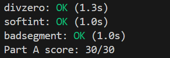
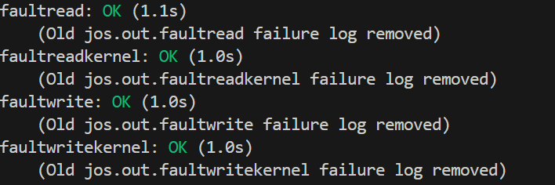
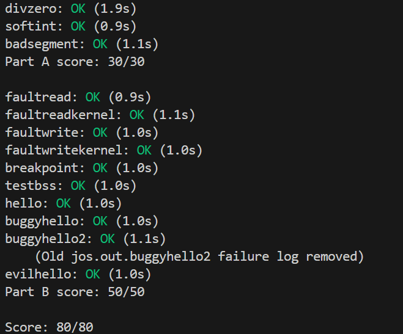

# Lab3 Report
## Challenge
Challenge! Modify the JOS kernel monitor so that you can '`continue`' execution from the current location (e.g., after the `int3`, if the kernel monitor was invoked via the breakpoint exception), and so that you can single-step one instruction at a time. You will need to understand certain bits of the `EFLAGS` register in order to implement single-stepping.

`TF=1`时
```
CPU 的单步模式被激活
    ↓
每执行完一条用户指令
    ↓
CPU 自动触发 #DB 异常（中断向量 1，T_DEBUG）
    ↓
进入异常处理
    ↓
内核可以检查/修改用户进程的状态
    ↓
iret 恢复用户进程
    ↓
执行下一条指令，再次触发 #DB...（循环）
```
1. `mon_continue()`
    
    清除`EFLAGS`中的`TF`位：

    `FL_TF`是定义好的常数

    `&= ~FL_TF`将`TF`位设为`0`（关闭单步模式）

    效果：恢复后的用户进程正常执行，不再每条指令后触发异常
    ```c
    int mon_continue(int argc, char **argv, struct Trapframe *tf) {
        if ((tf && (tf->tf_trapno == T_DEBUG || tf->tf_trapno == T_BRKPT) && 
            ((tf->tf_cs & 3) == 3))) {
            tf->tf_eflags &= ~FL_TF;
            return -1;
        } else {
            return 0;
        }
    }
    ```
2. `mon_step()`
    
    设置`EFLAGS`中的`TF`位：

    `|= FL_TF`将`TF`位设为`1`（打开单步模式）

    效果：恢复后的用户进程每执行一条指令后都会触发`#DB`异常
    ```c
    int mon_step(int argc, char **argv, struct Trapframe *tf) {
        if ((tf && (tf->tf_trapno == T_DEBUG || tf->tf_trapno == T_BRKPT) && 
            ((tf->tf_cs & 3) == 3))) {
            tf->tf_eflags |= FL_TF;
            return -1;
        } else {
            return 0;
        }
    }
    ```
运行`breakpoint`程序并输入`step`和`continue`命令的输出如下
```
[00000000] new env 00001000
Incoming TRAP frame at 0xefffffbc
Incoming TRAP frame at 0xefffffbc
Welcome to the JOS kernel monitor!
Type 'help' for a list of commands.
TRAP frame at 0xf01c6000
  edi  0x00000000
  esi  0x0080102c
  ebp  0xeebfdff0
  oesp 0xefffffdc
  ebx  0x00801000
  edx  0x00000000
  ecx  0x00000000
  eax  0xeec00000
  es   0x----0023
  ds   0x----0023
  trap 0x00000003 Breakpoint
  err  0x00000000
  eip  0x00800038
  cs   0x----001b
  flag 0x00000082
  esp  0xeebfdfc4
  ss   0x----0023
K> step
Incoming TRAP frame at 0xefffffbc
Welcome to the JOS kernel monitor!
Type 'help' for a list of commands.
TRAP frame at 0xf01c6000
  edi  0x00000000
  esi  0x0080102c
  ebp  0xeebfdff0
  oesp 0xefffffdc
  ebx  0x00801000
  edx  0x00000000
  ecx  0x00000000
  eax  0xeec00000
  es   0x----0023
  ds   0x----0023
  trap 0x00000001 Debug
  err  0x00000000
  eip  0x00800092
  cs   0x----001b
  flag 0x00000182
  esp  0xeebfdfc8
  ss   0x----0023
K> step
Incoming TRAP frame at 0xefffffbc
Welcome to the JOS kernel monitor!
Type 'help' for a list of commands.
TRAP frame at 0xf01c6000
  edi  0x00000000
  esi  0x0080102c
  ebp  0xeebfdff0
  oesp 0xefffffdc
  ebx  0x00801000
  edx  0x00000000
  ecx  0x00000000
  eax  0xeec00000
  es   0x----0023
  ds   0x----0023
  trap 0x00000001 Debug
  err  0x00000000
  eip  0x008000a6
  cs   0x----001b
  flag 0x00000182
  esp  0xeebfdfc4
  ss   0x----0023
K> continue
Incoming TRAP frame at 0xefffffbc
[00001000] exiting gracefully
[00001000] free env 00001000
Destroyed the only environment - nothing more to do!
```
## Part A: User Environments and Exception Handling

```c
'envid_t'
+1+---------------21-----------------+--------10--------+
|0|          Uniqueifier             |   Environment    |
| |                                  |      Index       |
+------------------------------------+------------------+
                                      \--- ENVX(eid) --/
1. ENVX(eid): index in the 'envs[]' array
2. Uniqueifier: distinguishes environments created at different times, but sharing the same environment index.

struct Env {
	struct Trapframe env_tf;	// Saved registers
	struct Env *env_link;		// Next free Env
	envid_t env_id;			// Unique environment identifier
	envid_t env_parent_id;		// env_id of this env's parent
	enum EnvType env_type;		// Indicates special system environments
	unsigned env_status;		// Status of the environment
	uint32_t env_runs;		// Number of times environment has run

	// Address space
	pde_t *env_pgdir;		// Kernel virtual address of page dir
};

struct Trapframe {
	struct PushRegs tf_regs;
	uint16_t tf_es;
	uint16_t tf_padding1;
	uint16_t tf_ds;
	uint16_t tf_padding2;
	uint32_t tf_trapno;
	/* below here defined by x86 hardware */
	uint32_t tf_err;
	uintptr_t tf_eip;
	uint16_t tf_cs;
	uint16_t tf_padding3;
	uint32_t tf_eflags;
	/* below here only when crossing rings, such as from user to kernel */
	uintptr_t tf_esp;
	uint16_t tf_ss;
	uint16_t tf_padding4;
} __attribute__((packed));

```
### Allocating the Environments Array
#### Exercise 1
Modify `mem_init()` in `kern/pmap.c` to allocate and map the envs array. This array consists of exactly `NENV` instances of the `Env` structure allocated much like how you allocated the pages array. Also like the pages array, the memory backing envs should also be mapped user read-only at `UENVS` (defined in `inc/memlayout.h`) so user processes can read from this array.

You should run your code and make sure `check_kern_pgdir()` succeeds.
#### Answer
发现`kern_pgdir`被异常覆盖
```
DEBUG: kern_pgdir (after boot_alloc) = f0181000
DEBUG: kern_pgdir (after memset) = 00000000
kernel panic at kern/pmap.c:155: PADDR called with invalid kva 00000000
```
参考[https://qiita.com/kagurazakakotori/items/334ab87a6eeb76711936
](https://qiita.com/kagurazakakotori/items/334ab87a6eeb76711936
)在`kern/kernel.ld`中给`.bss`段加上`*(COMMON)`即可解决

```c
envs = (struct Env *) boot_alloc(NENV * sizeof(struct Env));
memset(envs, 0, NENV * sizeof(struct Env));
boot_map_region(kern_pgdir, UENVS, PTSIZE, PADDR(envs), PTE_U);
```

### Creating and Running Environments
#### Exercise 2
In the file `env.c`, finish coding the following functions:

1. `env_init()`

    Initialize all of the `Env` structures in the envs array and add them to the `env_free_list`. Also calls `env_init_percpu`, which configures the segmentation hardware with separate segments for privilege level 0 (kernel) and privilege level 3 (user).

2. `env_setup_vm()`

    Allocate a page directory for a new environment and initialize the kernel portion of the new environment's address space.

3. `region_alloc()`

    Allocates and maps physical memory for an environment 

4. `load_icode()`

    You will need to parse an ELF binary image, much like the boot loader already does, and load its contents into the user address space of a new environment.

5. `env_create()`

    Allocate an environment with `env_alloc` and call `load_icode` to load an ELF binary into it.

6. `env_run()`

    Start a given environment running in user mode.
    As you write these functions, you might find the new cprintf verb `%e` useful -- it prints a description corresponding to an error code. For example,
    ```c
        r = -E_NO_MEM;
        panic("env_alloc: %e", r);
    ```
    will panic with the message "env_alloc: out of memory".

#### Answer
1. `env_init()`

    初始化每一个环境的数据结构并加入空闲链表。
    ```c
    void
    env_init(void)
    {
        // Set up envs array
        // LAB 3: Your code here.
        for (int i = NENV - 1; i >= 0; i--) {
            envs[i].env_id = 0;
            envs[i].env_status = ENV_FREE;
            envs[i].env_link = env_free_list;
            env_free_list = &envs[i]; // env_free_list指向最新加入的空闲env，envs[0]
        }

        // Per-CPU part of the initialization
        env_init_percpu();
    }
    ```
2. `env_setup_vm()`

    为一个环境创建虚拟内存空间，分配一个物理页作为这个环境的页目录并以`kern_pgdir`为模板建立映射。

    `kern_pgdir`已经在`mem_init()`中完全初始化，包含了`UTOP`以上的所有映射。

    因为所有用户环境在`UTOP`以上的虚拟地址空间映射完全相同——它们都需要映射内核代码、内核数据、内核栈等，而这部分在`kern_pgdir`中已经全部设置好了。所以直接复制`kern_pgdir`整个页目录，省去逐个设置PDE的麻烦。
    ```c
    static int
    env_setup_vm(struct Env *e)
    {
        int i;
        struct PageInfo *p = NULL;

        // Allocate a page for the page directory
        if (!(p = page_alloc(ALLOC_ZERO)))
            return -E_NO_MEM;

        // LAB 3: Your code here.
        e->env_pgdir = (pde_t *)page2kva(p);
        p->pp_ref++;
        memcpy(e->env_pgdir, kern_pgdir, PGSIZE); // use kern_pgdir as a template
        
        // UVPT maps the env's own page table read-only.
        // Permissions: kernel R, user R
        e->env_pgdir[PDX(UVPT)] = PADDR(e->env_pgdir) | PTE_P | PTE_U;

        return 0;
    }
    ```
3. `region_alloc()`

    为一个环境分配`len`字节（页大小对齐）的物理空间并建立映射。
    ```c
    static void
    region_alloc(struct Env *e, void *va, size_t len)
    {
        // LAB 3: Your code here.
        uintptr_t start = (uintptr_t) ROUNDDOWN(va, PGSIZE); // 下取整，页大小对齐
        uintptr_t end = (uintptr_t) ROUNDUP(va + len, PGSIZE); // 上取整
        for (uintptr_t addr = start; addr < end; addr += PGSIZE) { // 对于va开始len字节以内的每一个页分配物理页并且建立映射
            struct PageInfo *pp = page_alloc(0);
            if (!pp)
                panic("region_alloc: page_alloc failed");
            if (page_insert(e->env_pgdir, pp, (void *)addr, PTE_W | PTE_U) < 0)
                panic("region_alloc: page_insert failed");
        }
        
    }
    ```
4. `load_icode()`

    把每个program segemnt加载到虚拟内存中。
    在`boot loader`中是这样加载`segments`的
    ```c
    struct Proghdr *ph, *eph;
    // load each program segment (ignores ph flags)
    ph = (struct Proghdr *) ((uint8_t *) ELFHDR + ELFHDR->e_phoff);
    eph = ph + ELFHDR->e_phnum;
    for (; ph < eph; ph++)
        readseg(ph->p_pa, ph->p_memsz, ph->p_offset);
    ```
    根据Hints：
    - `ph->p_va`: segment's virtual address
    - `ph->p_memsz`: its size in memory
    - `[binary + ph->p_offset, binary + ph->p_offset + ph->p_filesz)` should be copied to virtual address `ph->p_va`; remaining memory bytes should be cleared to zero
    - Which page directory should be in force during this function? 应该用`e->env_pgdir`作为页目录来翻译虚拟地址，要在使用虚拟地址进行复制之前切换到环境页目录，完成复制后切换回内核页目录。`CR3`的值决定了"哪些虚地址映射到哪些物地址"
    - do something with the program's entry point, to make sure that the environment starts executing there. 把环境的eip(存放下一条要执行的指令的虚拟地址)设为binary的执行入口
    - 
    ```c
    lcr3(PADDR(e->env_pgdir)); // switch to the environment's page directory
	struct Elf *elf_hdr = (struct Elf *)binary;
	if (elf_hdr->e_magic != ELF_MAGIC)
		panic("load_icode: invalid ELF magic number");
	struct Proghdr *ph, *eph;
	ph = (struct Proghdr *)(binary + elf_hdr->e_phoff);
	eph = ph + elf_hdr->e_phnum;
	for (; ph < eph; ph++) {
		if (ph->p_type != ELF_PROG_LOAD)
			continue;
		region_alloc(e, (void *)ph->p_va, ph->p_memsz);
		// [binary + ph->p_offset, binary + ph->p_offset + ph->p_filesz)
		//  should be copied to virtual address ph->p_va
		memcpy((void *)ph->p_va, binary + ph->p_offset, ph->p_filesz);
		// remaining memory bytes should be cleared to zero
		memset((void *)(ph->p_va + ph->p_filesz), 0, ph->p_memsz - ph->p_filesz);
	}
	// 设置程序入口点
	e->env_tf.tf_eip = elf_hdr->e_entry;
	// 为栈分配一页
	region_alloc(e, (void *)(USTACKTOP - PGSIZE), PGSIZE);
    lcr3(PADDR(kern_pgdir)); // switch back to the kernel's page directory
    ```
5. `env_create()`
    `int env_alloc(struct Env **newenv_store, envid_t parent_id)` allocates and initializes a new environment. On success, the new environment is stored in *newenv_store.
    - Allocates a new env with `env_alloc`
    - Loads the named elf binary into it with `load_icode`
    - The new env's parent ID is set to 0
    ```c
    void
    env_create(uint8_t *binary, enum EnvType type)
    {
        // LAB 3: Your code here.
        struct Env *newenv;
        if (env_alloc(&newenv, 0) < 0) // allocates a new env, parent_id = 0
            panic("env_create: env_alloc failed");
        load_icode(newenv, binary); // load the named elf binary into it
        newenv->env_type = type;
    }
    ```
6. `env_run()`

    Context switch from curenv to env e.

    Step 1: If this is a context switch (a new environment is running):
	1. Set the current environment (if any) back to `ENV_RUNNABLE` if it is `ENV_RUNNING` (think about what other states it can be in), 可能是`ENV_DYING`的状态？
	2. Set `curenv` to the new environment,
	3. Set its status to `ENV_RUNNING`,
	4. Update its `env_runs` counter,
	5. Use `lcr3()` to switch to its address space.
	Step 2: Use `env_pop_tf()` to restore the environment's registers and drop into user mode in the environment.
    ```c
    kern/env.h
    extern struct Env *envs;		// All environments
    extern struct Env *curenv;		// Current environment  
    ```
    ```c
    void
    env_run(struct Env *e)
    {
        // LAB 3: Your code here.
        if (curenv && curenv->env_status == ENV_RUNNING)
            curenv->env_status = ENV_RUNNABLE;
        curenv = e;
        curenv->env_status = ENV_RUNNING;
        curenv->env_runs++;
        lcr3(PADDR(curenv->env_pgdir));
        env_pop_tf(&curenv->env_tf);
        // panic("env_run not yet implemented");
    }
    ```
调用关系
```c
env_create()
    -->env_alloc()
        -->env_setup_vm()
    -->load_icode()
        -->region_alloc()
```
输出
```
check_page_free_list() succeeded!
check_page_alloc() succeeded!
check_page() succeeded!
check_kern_pgdir() succeeded!
check_page_free_list() succeeded!
check_page_installed_pgdir() succeeded!
[00000000] new env 00001000
EAX=00000000 EBX=00000000 ECX=00000000 EDX=00000000
ESI=00000000 EDI=00000000 EBP=00000000 ESP=eebfe000
EIP=00800020 EFL=00000202 [-------] CPL=3 II=0 A20=1 SMM=0 HLT=0
ES =0023 00000000 ffffffff 00cff300 DPL=3 DS   [-WA]
CS =001b 00000000 ffffffff 00cffa00 DPL=3 CS32 [-R-]
SS =0023 00000000 ffffffff 00cff300 DPL=3 DS   [-WA]
DS =0023 00000000 ffffffff 00cff300 DPL=3 DS   [-WA]
FS =0023 00000000 ffffffff 00cff300 DPL=3 DS   [-WA]
GS =0023 00000000 ffffffff 00cff300 DPL=3 DS   [-WA]
LDT=0000 00000000 00000000 00008200 DPL=0 LDT
TR =0028 f0181b80 00000067 00408900 DPL=0 TSS32-avl
GDT=     f011c300 0000002f
IDT=     f0181360 000007ff
CR0=80050033 CR2=00000000 CR3=003bc000 CR4=00000000
DR0=00000000 DR1=00000000 DR2=00000000 DR3=00000000 
DR6=ffff0ff0 DR7=00000400
EFER=0000000000000000
Triple fault.  Halting for inspection via QEMU monitor.
```
GDB输出
```
=> 0xf0103a18 <env_pop_tf+31>:  iret
0xf0103a18      472             asm volatile(
(gdb) si
=> 0x800020:    cmp    $0xeebfe000,%esp
0x00800020 in ?? ()
(gdb) b *0x800b5b
Breakpoint 2 at 0x800b5b
(gdb) c
Continuing.
=> 0x800b5b:    int    $0x30
```
其中第二个断点根据`obj/user/hello.asm`中
```S
800b5b:	cd 30                	int    $0x30
```

### Handling Interrupts and Exceptions
implement basic exception and system call handling, so that it is possible for the kernel to recover control of the processor from user-mode code

#### Exercise 3
Read [Chapter 9, Exceptions and Interrupts](https://web.archive.org/web/20250420202206/https://pdos.csail.mit.edu/6.828/2018/readings/i386/c09.htm) in the [80386 Programmer's Manual](https://web.archive.org/web/20250420202206/https://pdos.csail.mit.edu/6.828/2018/readings/i386/toc.htm) (or [Chapter 5 of the IA-32 Developer's Manual](https://web.archive.org/web/20250420202206/https://pdos.csail.mit.edu/6.828/2018/readings/ia32/IA32-3A.pdf)), if you haven't already.

Interrupts: handle **asynchronous** events external to the processor
- Maskable interrupts, which are signalled via the INTR pin.
- Nonmaskable interrupts, which are signalled via the NMI (Non-Maskable Interrupt) pin.


#### Exercise 4
```
      IDT                   trapentry.S         trap.c
+----------------+                        
|   &handler1    |---------> handler1:          trap (struct Trapframe *tf)
|                |             // do stuff      {
|                |             call trap          // handle the exception/interrupt
|                |             // ...           }
+----------------+
|   &handler2    |--------> handler2:
|                |            // do stuff
|                |            call trap
|                |            // ...
+----------------+
       .
       .
       .
+----------------+
|   &handlerX    |--------> handlerX:
|                |             // do stuff
|                |             call trap
|                |             // ...
+----------------+
```
Edit `trapentry.S` and `trap.c` and implement the features described above. The macros `TRAPHANDLER` and `TRAPHANDLER_NOEC` in `trapentry.S` should help you, as well as the `T_*` defines in `inc/trap.h`. You will need to add an entry point in `trapentry.S` (using those macros) for each trap defined in `inc/trap.h`, and you'll have to provide `_alltraps` which the `TRAPHANDLER` macros refer to. You will also need to modify `trap_init()` to initialize the idt to point to each of these entry points defined in `trapentry.S`; the `SETGATE` macro will be helpful here.

Your `_alltraps` should:

1. push values to make the stack look like a `struct Trapframe`
2. load `GD_KD` into `%ds` and `%es`
3. `pushl %esp` to pass a pointer to the `Trapframe` as an argument to `trap()`
4. call trap (can trap ever return?)
Consider using the `pushal` instruction; it fits nicely with the layout of the `struct Trapframe`.

Test your trap handling code using some of the test programs in the user directory that cause exceptions before making any system calls, such as `user/divzero`. You should be able to get `make grade` to succeed on the `divzero`, `softint`, and `badsegment` tests at this point.

#### Answer
参考了[https://qiita.com/kagurazakakotori/items/334ab87a6eeb76711936](https://qiita.com/kagurazakakotori/items/334ab87a6eeb76711936)中的汇总表格

Interrupt No. |	Name	| Error Code?
---|---|---
0	|Divide Error Exception (#DE)|	No
1	|Debug Exception (#DB)|	No
2	|NMI Interrupt|	No
3	|Breakpoint Exception (#BP)|	No
4	|Overflow Exception (#OF)|	No
5	|BOUND Range Exceeded Exception (#BR)|	No
6	|Invalid Opcode Exception (#UD)|	No
7	|Device Not Available Exception (#NM)|	No
8	|Double Fault Exception (#DF)|	Yes
10	|Invalid TSS Exception (#TS)|	Yes
11	|Segment Not Present (#NP)|	Yes
12	|Stack Fault Exception (#SS)|	Yes
13	|General Protection Exception (#GP)|	Yes
14	|Page-Fault Exception (#PF)|	Yes
16	|x87 FPU Floating-Point Error (#MF)|	No
17	|Alignment Check Exception (#AC)|	Yes
18	|Machine-Check Exception (#MC)|	No
19	|SIMD Floating-Point Exception (#XM)|	No

```c
struct Trapframe {
	struct PushRegs tf_regs;
	uint16_t tf_es;
	uint16_t tf_padding1;
	uint16_t tf_ds;
	uint16_t tf_padding2;
	uint32_t tf_trapno;
	/* below here defined by x86 hardware */
	uint32_t tf_err;
	uintptr_t tf_eip;
	uint16_t tf_cs;
	uint16_t tf_padding3;
	uint32_t tf_eflags;
	/* below here only when crossing rings, such as from user to kernel */
	uintptr_t tf_esp;
	uint16_t tf_ss;
	uint16_t tf_padding4;
} __attribute__((packed));

```
`tf_ss`，`tf_esp`，`tf_eflags`，`tf_cs`，`tf_eip`，`tf_err`在中断发生时由处理器压入，所以现在只需要压入剩下寄存器（`%ds`,`%es`,通用寄存器）

控制流如下
```
1. 异常发生
   ↓
2. CPU 自动：压入 EIP, CS, EFLAGS, ESP, SS（如果特权级改变）
   ↓
3. TRAPHANDLER 宏跳转到的代码：pushl $num; jmp _alltraps
   ↓
4. _alltraps:
   - 保存 DS, ES, 所有通用寄存器（构建 Trapframe）
   - 切换 DS/ES 到内核
   - 传递 Trapframe 指针，现在 ESP 指向栈上构建好的 struct Trapframe 对象的起始地址
   - call trap()
   ↓
5. trap() 在 C 中处理异常
   - 分派给具体的异常处理函数（page_fault_handler 等）
   - 可能修改环境状态或销毁进程
   ↓
6. trap()
```
```s
/*
 * Lab 3: Your code here for generating entry points for the different traps.
 */
TRAPHANDLER_NOEC(devide_handler, T_DIVIDE)
TRAPHANDLER_NOEC(debug_handler, T_DEBUG)
TRAPHANDLER_NOEC(nmi_handler, T_NMI)
TRAPHANDLER_NOEC(brkpt_handler, T_BRKPT)
TRAPHANDLER_NOEC(oflow_handler, T_OFLOW)
TRAPHANDLER_NOEC(bound_handler, T_BOUND)
TRAPHANDLER_NOEC(illop_handler, T_ILLOP)
TRAPHANDLER_NOEC(device_handler, T_DEVICE)
TRAPHANDLER(dblflt_handler, T_DBLFLT)		

TRAPHANDLER(tss_handler, T_TSS)	
TRAPHANDLER(segnp_handler, T_SEGNP)	
TRAPHANDLER(stack_handler, T_STACK)	
TRAPHANDLER(gpflt_handler, T_GPFLT)	
TRAPHANDLER(pgflt_handler, T_PGFLT)

TRAPHANDLER_NOEC(fperr_handler, T_FPERR)
TRAPHANDLER(align_handler, T_ALIGN)
TRAPHANDLER_NOEC(mchk_handler, T_MCHK)
TRAPHANDLER_NOEC(simderr_handler, T_SIMDERR)

/*
 * Lab 3: Your code here for _alltraps
 */
_alltraps:
	pushl %ds
	pushl %es
	pushal # 保存所有通用寄存器
	movw $GD_KD, %ax
	movw %ax, %ds
	movw %ax, %es
	pushl %esp
	call trap

```
```c
void
trap_init(void)
{
	extern struct Segdesc gdt[];

	// LAB 3: Your code here.
	void devide_handler();
	void debug_handler();
	void nmi_handler();
	void brkpt_handler();
	void oflow_handler();
	void bound_handler();
	void illop_handler();
	void device_handler();
	void dblflt_handler();
	void tss_handler();
	void segnp_handler();
	void stack_handler();
	void gpflt_handler();
	void pgflt_handler();
	void fperr_handler();
	void align_handler();
	void mchk_handler();
	void simderr_handler();
	SETGATE(idt[T_DIVIDE], 0, GD_KT, devide_handler, 0);
	SETGATE(idt[T_DEBUG], 0, GD_KT, debug_handler, 0);
	SETGATE(idt[T_NMI], 0, GD_KT, nmi_handler, 0);
	SETGATE(idt[T_BRKPT], 0, GD_KT, brkpt_handler, 3);
	SETGATE(idt[T_OFLOW], 0, GD_KT, oflow_handler, 0);
	SETGATE(idt[T_BOUND], 0, GD_KT, bound_handler, 0);
	SETGATE(idt[T_ILLOP], 0, GD_KT, illop_handler, 0);
	SETGATE(idt[T_DEVICE], 0, GD_KT, device_handler, 0);
	SETGATE(idt[T_DBLFLT], 0, GD_KT, dblflt_handler, 0);
	SETGATE(idt[T_TSS], 0, GD_KT, tss_handler, 0);
	SETGATE(idt[T_SEGNP], 0, GD_KT, segnp_handler, 0);
	SETGATE(idt[T_STACK], 0, GD_KT, stack_handler, 0);
	SETGATE(idt[T_GPFLT], 0, GD_KT, gpflt_handler, 0);
	SETGATE(idt[T_PGFLT], 0, GD_KT, pgflt_handler, 0);
	SETGATE(idt[T_FPERR], 0, GD_KT, fperr_handler, 0);
	SETGATE(idt[T_ALIGN], 0, GD_KT, align_handler, 0);
	SETGATE(idt[T_MCHK], 0, GD_KT, mchk_handler, 0);
	SETGATE(idt[T_SIMDERR], 0, GD_KT, simderr_handler, 0);
	// Per-CPU setup 
	trap_init_percpu();
}

```


#### Questions

Answer the following questions in your answers-lab3.txt:

1. What is the purpose of having an individual handler function for each exception/interrupt? (i.e., if all exceptions/interrupts were delivered to the same handler, what feature that exists in the current implementation could not be provided?)

    1. Error Code
        没有独立的异常处理函数就无法push这个异常具体的错误码，无法针对性地解决问题。单一的异常处理函数不知道是否有错误码，无法正确解析Tarp Frame。
    2. Handling Logic
        处理各个异常的逻辑都不同，如果要用单一的异常处理函数那么它的逻辑会十分复杂。
    3. DPL
        如果所有异常都通过同一个处理函数，那么 IDT 中该条目的`DPL`要么统一为 0（仅内核可调用），要么统一为 3（用户可调用）。这就无法对某些异常（如`int 3`断点）开放用户访问，同时又防止用户代码调用其他危险异常（如`int 14`模拟页表异常）。
    
2. Did you have to do anything to make the `user/softint` program behave correctly? The grade script expects it to produce a general protection fault (trap 13), but softint's code says `int $14`. Why should this produce interrupt vector 13? What happens if the kernel actually allows softint's `int $14` instruction to invoke the kernel's page fault handler (which is interrupt vector 14)?
    - 不需要任何处理即可在`user/softint`程序里触发`int $13`
    - 运行`int $14`时，CPU处于用户态，当前`CPL=3`
    - `idt[14]`对应的`DPL=0`，仅内核可以调用
    - 特权检查失败，CPU自动触发`general protection`异常，对应`int $13`

## Part B: Page Faults, Breakpoints Exceptions, and System Calls
### Handling Page Faults
When the processor takes a page fault, it stores the linear (i.e., virtual) address that caused the fault in a special processor control register, `CR2`. 

#### Exercise 5
Modify `trap_dispatch()` to dispatch page fault exceptions to `page_fault_handler()`. You should now be able to get make grade to succeed on the `faultread`, `faultreadkernel`, `faultwrite`, and `faultwritekernel` tests. If any of them don't work, figure out why and fix them. Remember that you can boot JOS into a particular user program using `make run-x` or `make run-x-nox`. For instance, `make run-hello-nox` runs the `hello` user program.

`trap_dispatch()`把具体的异常种类分派给相应处理函数（例如：`page_fault_handler()`、`syscall`、`breakpoint` 等）。`trap_dispatch`根据`tf->tf_trapno`、`tf->tf_err`等执行对应动作。
```c
static void
trap_dispatch(struct Trapframe *tf)
{
	// Handle processor exceptions.
	// LAB 3: Your code here.
	if (tf->tf_trapno == T_PGFLT) {
		page_fault_handler(tf);
		return;
	}
	// Unexpected trap: The user process or the kernel has a bug.
	print_trapframe(tf);
	if (tf->tf_cs == GD_KT)
		panic("unhandled trap in kernel");
	else {
		env_destroy(curenv);
		return;
	}
}
```


### The Breakpoint Exception
#### Exercise 6
Modify `trap_dispatch()` to make breakpoint exceptions invoke the kernel monitor. You should now be able to get `make grade` to succeed on the breakpoint test.

在`trap_dispatch()`中新增
```c
if (tf->tf_trapno == T_BRKPT) {
		monitor(tf);
		return;
	}
```
#### Questions

3. The break point test case will either generate a break point exception or a general protection fault depending on how you initialized the break point entry in the IDT (i.e., your call to `SETGATE` from `trap_init`). Why? How do you need to set it up in order to get the breakpoint exception to work as specified above and what incorrect setup would cause it to trigger a general protection fault?

    - 正确的做法是设置`breakpoint`异常的`DPL=3`，这样用户程序也可以触发断点异常
    - 如果错误地设置为`DPL=0`，那么用户程序想要触发断点异常实际会因为没有内核权限而触发到`general protection`异常

4. What do you think is the point of these mechanisms, particularly in light of what the `user/softint` test program does?
    - 这些机制限制了用户程序可以触发的异常
    - 如果一些异常处理函数只能被内核调用，那么用户程序的调用会触发通用保护异常
    - 这保护了内核的健壮性，不易被用户程序攻击

### System calls
系统调用的控制流如下
```
用户代码调用：sys_cputs("Hello", 5)
    ↓
sys_cputs() 调用 syscall(SYS_cputs, 0, (uint32_t)"Hello", 5, 0, 0, 0)
    ↓
syscall() 内联汇编：
    movl   $0,     %eax       ← EAX = SYS_cputs (系统调用号)
    movl   $buffer, %edx      ← EDX = "Hello" (参数1)
    movl   $5,     %ecx       ← ECX = 5 (参数2)
    int    $T_SYSCALL         ← 触发异常，进入内核
    ↓
CPU：
    1. 禁止中断（自动）
    2. 保存当前特权级信息（CS, EIP, EFLAGS, ESP, SS）到栈
    3. 特权级切换：3 (用户) → 0 (内核)
    4. 跳转到 IDT[T_SYSCALL] 的处理函数
    ↓
内核 trap 处理：
    _alltraps() → trap() → trap_dispatch()
    ↓
内核识别中断类型是 T_SYSCALL，调用 syscall() 内核处理函数
    ↓
内核从寄存器读取参数：
    EAX = 系统调用号
    EDX, ECX, EBX, EDI, ESI = 参数1-5
    根据系统调用号分派到具体处理函数
    ↓
内核处理完毕，设置返回值到 EAX
    ↓
iret 返回用户态
    ↓
用户代码：
    EAX 中已有返回值
    内联汇编把 EAX 赋给 ret
    if(check && ret > 0) panic(...)  ← 可选的错误检查
    return ret
```
#### Exercise 7
Add a handler in the kernel for interrupt vector `T_SYSCALL`. You will have to edit `kern/trapentry.S` and `kern/trap.c`'s `trap_init()`. You also need to change `trap_dispatch()` to handle the system call interrupt by calling `syscall()` (defined in `kern/syscall.c`) with the appropriate arguments, and then arranging for the return value to be passed back to the user process in %eax. Finally, you need to implement `syscall()` in `kern/syscall.c`. Make sure `syscall()` returns `-E_INVAL` if the system call number is invalid. You should read and understand `lib/syscall.c` (especially the inline assembly routine) in order to confirm your understanding of the system call interface. Handle all the system calls listed in `inc/syscall.h` by invoking the corresponding kernel function for each call.

Run the `user/hello` program under your kernel (`make run-hello`). It should print "`hello, world`" on the console and then cause a page fault in user mode. If this does not happen, it probably means your system call handler isn't quite right. You should also now be able to get make grade to succeed on the testbss test.

#### Answer
Inline Assembly
```s
asm volatile("汇编指令模板"
    : 输出操作数（output operands）
    : 输入操作数（input operands）
    : 被破坏的寄存器/标志（clobber list）);
```
看一下`syscall`函数都做了什么，其实就是文档里写的传入和返回
```s
static inline int32_t
syscall(int num, int check, uint32_t a1, uint32_t a2, uint32_t a3, uint32_t a4, uint32_t a5)
{
    int32_t ret;

    asm volatile("int %1\n"
            : "=a" (ret)
            : "i" (T_SYSCALL),
            "a" (num),
            "d" (a1),
            "c" (a2),
            "b" (a3),
            "D" (a4),
            "S" (a5)
            : "cc", "memory");

    if(check && ret > 0)
		panic("syscall %d returned %d (> 0)", num, ret);

    return ret;
}
```
1. 加入`T_SYSCALL`的handler
    ```s
    TRAPHANDLER_NOEC(syscall_handler, T_SYSCALL)
    ```
2. 在`trap_init()`里加入`syscall_handler`
    ```c
    void syscall_handler();
    SETGATE(idt[T_SYSCALL], 0, GD_KT, syscall_handler, 3);
    ```
3. 在`trap_dispatch()`里加入`syscall`的处理
    ```c
    if (tf->tf_trapno == T_SYSCALL) {
		uint32_t ret = syscall(
			tf->tf_regs.reg_eax,
			tf->tf_regs.reg_edx,
			tf->tf_regs.reg_ecx,
			tf->tf_regs.reg_ebx,
			tf->tf_regs.reg_edi,
			tf->tf_regs.reg_esi
		);
		tf->tf_regs.reg_eax = ret;
		return;
	}
    ```
4. 在`kern/syscall`里完成`syscall()`的实现
    ```c
    // Dispatches to the correct kernel function, passing the arguments.
    int32_t
    syscall(uint32_t syscallno, uint32_t a1, uint32_t a2, uint32_t a3, uint32_t a4, uint32_t a5)
    {
        // Call the function corresponding to the 'syscallno' parameter.
        // Return any appropriate return value.
        // LAB 3: Your code here.
        switch (syscallno) {
        case SYS_cputs:
            sys_cputs((const char *)a1, (size_t)a2);
            return 0;
        case SYS_cgetc:
            return sys_cgetc();
        case SYS_getenvid:
            return sys_getenvid();
        case SYS_env_destroy:
            return sys_env_destroy((envid_t)a1);
        default:
            return -E_INVAL;
        }
    }
    ```

运行`make run-hello`输出
```
hello, world
Incoming TRAP frame at 0xefffffbc
[00001000] user fault va 00000048 ip 0080005d
TRAP frame at 0xf01c5000
  edi  0x00000000
  esi  0x00000000
  ebp  0xeebfdfd0
  oesp 0xefffffdc
  ebx  0x00801000
  edx  0xeebfde88
  ecx  0x0000000d
  eax  0x00000000
  es   0x----0023
  ds   0x----0023
  trap 0x0000000e Page Fault
  cr2  0x00000048
  err  0x00000004 [user, read, not-present]
  eip  0x0080005d
  cs   0x----001b
  flag 0x00000092
  esp  0xeebfdfb8
  ss   0x----0023
[00001000] free env 00001000
Destroyed the only environment - nothing more to do!
```
### User-mode startup
1. modify `libmain()` to initialize the global pointer `thisenv` to point at this environment's `struct Env` in the `envs[]` array
    - `lib/entry.S` has already defined `envs` to point at the `UENVS` mapping
    - Hint: look in `inc/env.h` and use `sys_getenvid`
2. `libmain()` then calls `umain (user/hello.c)`
    - printing "`hello, world`"
    - tries to access `thisenv->env_id` -> Fault
#### Exercise 8
Add the required code to the user library, then boot your kernel. You should see `user/hello` print "`hello, world`" and then print "`i am environment 00001000`". `user/hello` then attempts to "exit" by calling `sys_env_destroy()` (see `lib/libmain.c` and `lib/exit.c`). Since the kernel currently only supports one user environment, it should report that it has destroyed the only environment and then drop into the kernel monitor. You should be able to get `make grade` to succeed on the hello test.

#### Answer
在`lib/libbmian.c`中新增
```c
thisenv = &envs[ENVX(sys_getenvid())];
```

### Page faults and memory protection
处理page faults时用户程序会向内核传递将被读写的用户buffer的指针，为了防止受到用户程序的攻击，内核要仔细检查这些参数是否在用户的地址空间里并且允许内存操作。

#### Exercise 9
Change `kern/trap.c` to panic if a page fault happens in kernel mode.

Hint: to determine whether a fault happened in user mode or in kernel mode, check the low bits of the `tf_cs`.

Read `user_mem_assert` in `kern/pmap.c` and implement `user_mem_check` in that same file.

Change `kern/syscall.c` to sanity check arguments to system calls.

Boot your kernel, running `user/buggyhello`. The environment should be destroyed, and the kernel should not panic. You should see:
```
[00001000] user_mem_check assertion failure for va 00000001
[00001000] free env 00001000
Destroyed the only environment - nothing more to do!
```
Finally, change `debuginfo_eip` in `kern/kdebug.c` to call `user_mem_check` on `usd`, `stabs`, and `stabstr`. If you now run `user/breakpoint`, you should be able to run backtrace from the kernel monitor and see the backtrace traverse into `lib/libmain.c` before the kernel panics with a page fault. What causes this page fault? You don't need to fix it, but you should understand why it happens.

#### Answer
1. `trap_dispatch()`
    page fault对应部分中新增判断是否为内核态页故障，是的话panic
    ```c
    if (tf->tf_trapno == T_PGFLT) {
        if ((tf->tf_cs & 3) == 0) {
            panic("page fault in kernel mode");
        }
        page_fault_handler(tf);
        return;
    }
    ```
2. `user_mem_check()`
    对于`[va, va+len)`中的每一页，检查
    - 是否在`ULIM`下方
    - 页表中是否对应权限

    任一项不满足都返回`-E_FAULT`，都满足返回`0`
    
    一开始忘记判断`va`和`addr`中的较大者，直接用了`addr`，但因为`va`向下取整过，所以当`addr`是`va`下取整结果时，应该使用`va`作为`user_mem_check_addr`
    ```c
    int
    user_mem_check(struct Env *env, const void *va, size_t len, int perm)
    {
        // LAB 3: Your code here.
        uintptr_t start = ROUNDDOWN((uintptr_t)va, PGSIZE);
        uintptr_t end = ROUNDUP((uintptr_t)va + len, PGSIZE);
        for (uintptr_t addr = start; addr < end; addr += PGSIZE) {
            if (addr >= ULIM) {
                // first erroneous virtual address为va和addr中的较大者
                user_mem_check_addr = (addr < (uintptr_t)va) ? (uintptr_t)va : addr;
                return -E_FAULT;
            }
            pte_t* pte = pgdir_walk(env->env_pgdir, (void*)addr, false);
            if (!pte || (perm | PTE_P) != ((*pte) & (perm | PTE_P))) {
                user_mem_check_addr = (addr < (uintptr_t)va) ? (uintptr_t)va : addr;
                return -E_FAULT;
            }
        }
        return 0;
    }
    ```
3.  `sys_cputs()`
    增加系统调用前的指针检查，即使用`user_mem_assert()`调用刚刚完成的`user_mem_check()`来检查对应内存的访问权限
    ```c
    static void
    sys_cputs(const char *s, size_t len)
    {
        // Check that the user has permission to read memory [s, s+len).
        // Destroy the environment if not.

        // LAB 3: Your code here.
        user_mem_assert(curenv, (void *)s, len, PTE_U);

        // Print the string supplied by the user.
        cprintf("%.*s", len, s);
    }
    ```
4. `debuginfo_eip()`
    添加检查`usd`, `stabs`, `stabstr`对应内存权限的检查
    ```c
    if (user_mem_check(curenv, (void *)usd, sizeof(struct UserStabData), PTE_U) < 0) {
			return -1;
		}
	if (user_mem_check(curenv, (void *)stabs, stab_end - stabs, PTE_U) < 0 ||
		user_mem_check(curenv, (void *)stabstr, stabstr_end - stabstr, PTE_U) < 0 ) {
		return -1;
	}
    ```
#### Exercise 10
Boot your kernel, running `user/evilhello`. The environment should be destroyed, and the kernel should not panic. You should see:
```
[00000000] new env 00001000
...
[00001000] user_mem_check assertion failure for va f010000c
[00001000] free env 00001000
```

## Result
