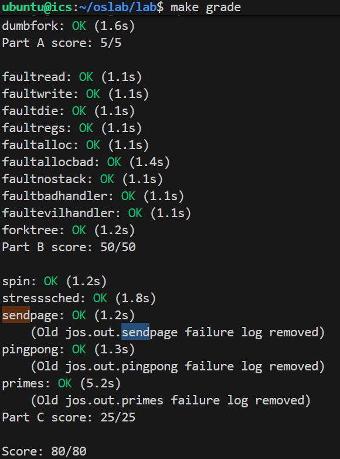
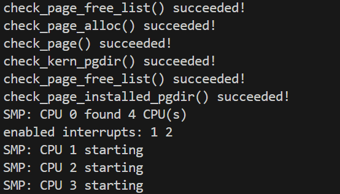
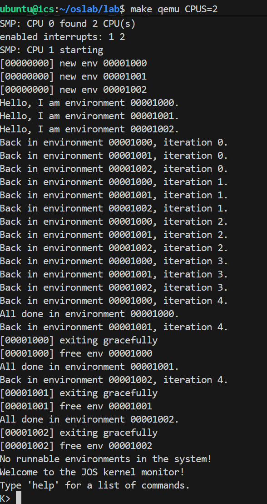
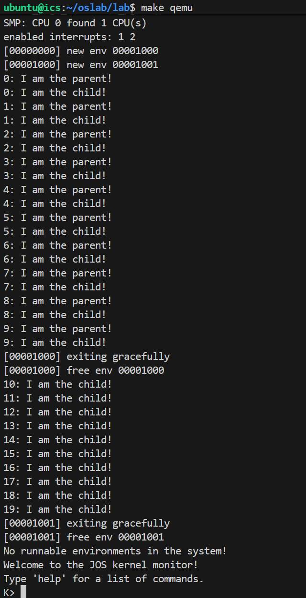
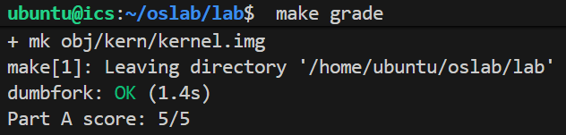
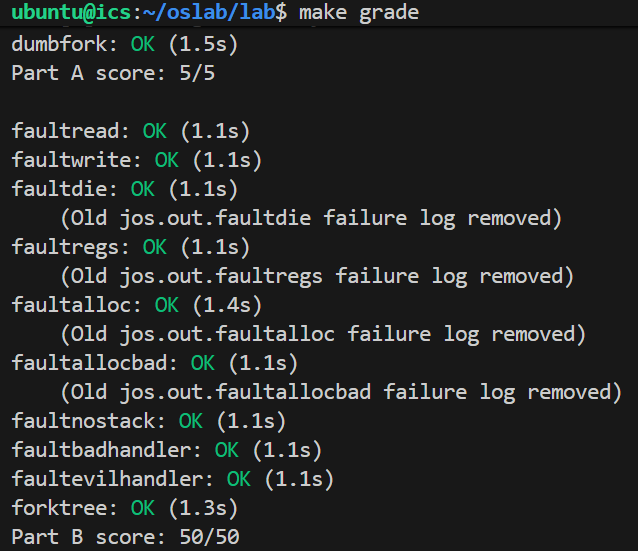

# Lab 4: Preemptive Multitasking

## Challenge
Challenge! Implement a shared-memory `fork()` called `sfork()`. This version should have the parent and child share all their memory pages (so writes in one environment appear in the other) except for pages in the stack area, which should be treated in the usual copy-on-write manner. Modify `user/forktree.c` to use `sfork()` instead of regular `fork()`. Also, once you have finished implementing IPC in part C, use your `sfork()` to run `user/pingpongs`. You will have to find a new way to provide the functionality of the global `thisenv` pointer.

### Answer
1. `sfork()`
	`sfork()`与`fork()`关键区别在于`for`循环内部对于栈页面和普通页面的分别处理。

	```c
	int
	sfork(void)
	{
		set_pgfault_handler(pgfault);
		envid_t envid = sys_exofork();
		if (envid < 0) {
			panic("sfork: sys_exofork failed: %e", envid);
		}
		if (envid == 0) {
			thisenv = &envs[ENVX(sys_getenvid())];
			return 0;
		}
		uint32_t addr;
		for (addr = 0; addr < USTACKTOP; addr += PGSIZE) {
			if ((uvpd[PDX(addr)] & PTE_P) && (uvpt[PGNUM(addr)] & PTE_P)) {
				int r;
				if (addr >= USTACKTOP - PGSIZE) {
					// Stack page: copy-on-write
					r = duppage(envid, PGNUM(addr));
					if (r < 0) {
						panic("sfork: duppage failed: %e", r);
					}
				} else {
					// Non-stack page: shared
					pte_t pte = uvpt[PGNUM(addr)];
					r = sys_page_map(0, (void *)addr, envid, (void *)addr, pte & PTE_SYSCALL);
					if (r < 0) {
						panic("sfork: sys_page_map failed: %e", r);
					}
				}
			}
		}
		int r = sys_page_alloc(envid, (void *)(UXSTACKTOP - PGSIZE), PTE_W | PTE_U | PTE_P);
		if (r < 0) {
			panic("sfork: sys_page_alloc failed: %e", r);
		}
		extern void _pgfault_upcall(void);
		r = sys_env_set_pgfault_upcall(envid, _pgfault_upcall);
		if (r < 0) {
			panic("sfork: sys_env_set_pgfault_upcall failed: %e", r);
		}
		r = sys_env_set_status(envid, ENV_RUNNABLE);
		if (r < 0) {
			panic("sfork: sys_env_set_status failed: %e", r);
		}
		return envid;
	}
	```
2. `inc/lib.h`
	a new way to provide the functionality of the global `thisenv` pointer

	`thisenv`赋值语句都注释掉，使用如下的宏定义
	```c
	// extern const volatile struct Env *thisenv;
	#define thisenv (&envs[ENVX(sys_getenvid())]) 
	```	

## Part A: Multiprocessor Support and Cooperative Multitasking

#### Exercise 1
Implement `mmio_map_region` in `kern/pmap.c`. To see how this is used, look at the beginning of `lapic_init` in `kern/lapic.c`. You'll have to do the next exercise, too, before the tests for `mmio_map_region` will run.
#### Answer
1. Reserve size bytes of virtual memory starting at base
2. Map physical pages `[pa,pa+size)` to virtual addresses `[base,base+size)`
3. `PTE_PCD|PTE_PWT` (cache-disable and write-through) in addition to `PTE_W`
4. Round size up to a multiple of `PGSIZE` and handle if this reservation would overflow `MMIOLIM`
```c
void *
mmio_map_region(physaddr_t pa, size_t size)
{
	static uintptr_t base = MMIOBASE;
	// Your code here:
	if (base + ROUNDUP(size, PGSIZE) > MMIOLIM)
		panic("mmio_map_region: overflow MMIOLIM\n");
	boot_map_region(kern_pgdir, base, ROUNDUP(size, PGSIZE), pa, PTE_W | PTE_PCD | PTE_PWT);
	uintptr_t ret = base;
	base += ROUNDUP(size, PGSIZE);
	return (void *)ret;
}
```

#### Exercise 2
Read `boot_aps()` and `mp_main()` in `kern/init.c`, and the assembly code in `kern/mpentry.S`. Make sure you understand the control flow transfer during the bootstrap of APs. Then modify your implementation of `page_init()` in `kern/pmap.c` to **avoid adding the page at `MPENTRY_PADDR` to the free list**, so that we can safely copy and run AP bootstrap code at that physical address. Your code should pass the updated `check_page_free_list()` test (but might fail the updated `check_kern_pgdir()` test, which we will fix soon).
#### Answer
`mpentry_start`和`mpentry_end`在汇编文件里定义`.globl mpentry_start`，先把这一段汇编代码移到
`MPENTRY_PADDR`处，然后执行这一段启动代码。

汇编代码完成从实模式到保护模式再到分页模式的转换，最终调用`mp_main`。

```c
page_init()

else if (i == MPENTRY_PADDR / PGSIZE) { // MP entry page
			pages[i].pp_ref = 1;
			pages[i].pp_link = NULL; 
		}
```
#### Question 1
1. Compare `kern/mpentry.S` side by side with `boot/boot.S`. Bearing in mind that `kern/mpentry.S` is compiled and linked to run above `KERNBASE` just like everything else in the kernel, what is the purpose of macro `MPBOOTPHYS`? Why is it necessary in `kern/mpentry.S` but not in `boot/boot.S`? In other words, what could go wrong if it were omitted in `kern/mpentry`.S?
Hint: recall the differences between the link address and the load address that we have discussed in Lab 1.
#### Answer
`mpentry.S`里的启动代码被复制到物理地址`0x7000 (MPENTRY_PADDR)`的地方，它的load addr是`0x7000`，而link addr是above `KERNBASE`的，所以要`#define MPBOOTPHYS(s) ((s) - mpentry_start + MPENTRY_PADDR)`来计算这段启动代码中的部分代码的物理地址；而在`boot.S`中link addr和load addr一样。

*The `BIOS` loads the `boot sector` into memory starting at address `0x7c00`, so this is the boot sector's `load address`.*

*We set the `link address` by passing `-Ttext 0x7C00` to the linker in `boot/Makefrag`.*

如果没有`MPBOOTPHYS`，会在实模式下访问高位地址，这是无效的，会造成许多访存错误。

#### Exercise 3
Modify `mem_init_mp()` (in `kern/pmap.c`) to map per-CPU stacks starting at `KSTACKTOP`, as shown in `inc/memlayout.h`. The size of each stack is `KSTKSIZE` bytes plus `KSTKGAP` bytes of unmapped guard pages. Your code should pass the new check in `check_kern_pgdir()`.
#### Answer
The array `percpu_kstacks[NCPU][KSTKSIZE]` reserves space for NCPU's worth of kernel stacks.
```c
static void
mem_init_mp(void)
{
	// LAB 4: Your code here:
	for (int i = 0; i < NCPU; i++) {
		boot_map_region(kern_pgdir, KSTACKTOP - i * (KSTKSIZE + KSTKGAP) - KSTKSIZE, KSTKSIZE, PADDR(percpu_kstacks[i]), PTE_W);
	}
}
```

#### Exercise 4
The code in `trap_init_percpu()` (`kern/trap.c`) initializes the `TSS` and `TSS` descriptor for the BSP. It worked in Lab 3, but is incorrect when running on other CPUs. Change the code so that it can work on all CPUs. (Note: your new code should not use the global `ts` variable any more.)
#### Answer
The `TSS` for CPU i is stored in `cpus[i].cpu_ts`, and the corresponding `TSS` descriptor is defined in the GDT entry `gdt[(GD_TSS0 >> 3) + i]`. The global `ts` variable defined in `kern/trap.c` will no longer be useful.
```c
void
trap_init_percpu(void)
{
	// LAB 4: Your code here:
	struct Taskstate *ts = &thiscpu->cpu_ts;
	ts->ts_esp0 = KSTACKTOP - thiscpu->cpu_id * (KSTKSIZE + KSTKGAP);
	ts->ts_ss0 = GD_KD;
	ts->ts_iomb = sizeof(struct Taskstate);
	// Initialize the TSS slot of the gdt.
	gdt[(GD_TSS0 >> 3) + thiscpu->cpu_id] = SEG16(STS_T32A, (uint32_t)(ts),
					sizeof(struct Taskstate) - 1, 0);
	gdt[(GD_TSS0 >> 3) + thiscpu->cpu_id].sd_s = 0;
	// Load the TSS selector (like other segment selectors, the
	// bottom three bits are special; we leave them 0)
	ltr(GD_TSS0 + (thiscpu->cpu_id << 3));

	// Load the IDT
	lidt(&idt_pd);
}
```



#### Exercise 5
Apply the big kernel lock as described above, by calling `lock_kernel()` and `unlock_kernel()` at the proper locations.
#### Answer
1. `i386_init()`
	```c
	// Acquire the big kernel lock before waking up APs
	// Your code here:
	lock_kernel();
	// Starting non-boot CPUs
	boot_aps();
	```
2. `mp_main()`
	```c
	// Your code here:
	lock_kernel();
	sched_yield();
	```
3. `trap()`
	```c
	if ((tf->tf_cs & 3) == 3) {
		// LAB 4: Your code here.
		lock_kernel();
		...
	}
	```
4. `env_run()`
	```c
	unlock_kernel();
	lcr3(PADDR(curenv->env_pgdir));
	env_pop_tf(&curenv->env_tf);
	```
#### Question 2

It seems that using the big kernel lock guarantees that only one CPU can run the kernel code at a time. Why do we still need separate kernel stacks for each CPU? Describe a scenario in which using a shared kernel stack will go wrong, even with the protection of the big kernel lock.

#### Answer
系统调用时cpu自动保存当前状态到内核栈是硬件自动执行的过程，不受big lock的约束，所以当2个cpu同时进入系统调用，使用shared stack会产生数据覆盖冲突。


#### Exercise 6
Implement round-robin scheduling in `sched_yield()` as described above. Don't forget to modify `syscall()` to dispatch `sys_yield()`.

Make sure to invoke `sched_yield()` in `mp_main`.

Modify `kern/init.c` to create three (or more!) environments that all run the program `user/yield.c`.

Run `make qemu`. You should see the environments switch back and forth between each other five times before terminating, like below.

Test also with several CPUS: `make qemu CPUS=2`.

```
Hello, I am environment 00001000.
Hello, I am environment 00001001.
Hello, I am environment 00001002.
Back in environment 00001000, iteration 0.
Back in environment 00001001, iteration 0.
Back in environment 00001002, iteration 0.
Back in environment 00001000, iteration 1.
Back in environment 00001001, iteration 1.
Back in environment 00001002, iteration 1.
```
After the yield programs exit, there will be no runnable environment in the system, the scheduler should invoke the JOS kernel monitor. If any of this does not happen, then fix your code before proceeding.

#### Answer
```c
void
sched_yield(void)
{
	struct Env *idle;
	// LAB 4: Your code here.
	idle = thiscpu->cpu_env;
	// just after the previously running environment
	int start_idx = idle ? (ENVX(idle->env_id) + 1) % NENV : 0; 
	// searches sequentially
	for (int i = 0; i < NENV; i++) {
		int idx = (start_idx + i) % NENV;
		if (envs[idx].env_status == ENV_RUNNABLE) {
			env_run(&envs[idx]);
			return;
		}
	}
	// no envs are runnable, but the environment previously
	// running on this CPU is still ENV_RUNNING
	if (idle && idle->env_status == ENV_RUNNING) {
		env_run(idle);
		return;
	}
	// sched_halt never returns
	sched_halt();
}
```
```c
int32_t
syscall(uint32_t syscallno, uint32_t a1, uint32_t a2, uint32_t a3, uint32_t a4, uint32_t a5)
{
	...
	case SYS_yield:
		sys_yield();
		return 0;
	...
}
```
```c
void
i386_init(void)
{
	...
	// Touch all you want.
	// ENV_CREATE(user_primes, ENV_TYPE_USER);
	ENV_CREATE(user_yield, ENV_TYPE_USER);
	ENV_CREATE(user_yield, ENV_TYPE_USER);
	ENV_CREATE(user_yield, ENV_TYPE_USER);
	...
}
```



#### Question 3
In your implementation of `env_run()` you should have called `lcr3()`. Before and after the call to `lcr3()`, your code makes references (at least it should) to the variable `e`, the argument to `env_run`. Upon loading the `%cr3` register, the addressing context used by the MMU is instantly changed. But a virtual address (namely `e`) has meaning relative to a given address context--the address context specifies the physical address to which the virtual address maps. Why can the pointer `e` be dereferenced both before and after the addressing switch?

#### Answer 
因为所有`struct Env`对象都在内核数据区，而所有环境中的页表都映射了相同的内核数据区，变换环境前后的两个页表对内核地址空间的映射完全一致，所以`e`可以在`lcr3()`切换页表前后都被正确地引用。

#### Question 4
Whenever the kernel switches from one environment to another, it must ensure the old environment's registers are saved so they can be restored properly later. Why? Where does this happen?

#### Answer
内核切换环境时需要保存旧环境的寄存器来确保它之后可以被恢复，因为cpu的寄存器是所有环境的共享资源，调度到其他环境后cpu的寄存器将被新环境的数据覆盖，为了在下次再调度到旧环境时恢复运行的上下文，需要把它的寄存器值保存起来。

每个`struct Env`都维护一个`struct Trapframe env_tf`结构用于保存寄存器状态，使用`env_run()`切换到新环境调用`env_pop_tf(&e->env_tf);`就可以恢复这个环境的寄存器值。

#### Exercise 7
Implement the system calls described above in `kern/syscall.c` and make sure `syscall()` calls them. You will need to use various functions in `kern/pmap.c` and `kern/env.c`, particularly `envid2env()`. For now, whenever you call `envid2env()`, pass 1 in the checkperm parameter. Be sure you check for any invalid system call arguments, returning `-E_INVAL` in that case. Test your JOS kernel with `user/dumbfork` and make sure it works before proceeding.

#### Answer
1. `sys_exofork`
	```c
	static envid_t
	sys_exofork(void)
	{
		// LAB 4: Your code here.
		struct Env *new_env;
		int ret = env_alloc(&new_env, curenv->env_id);
		if (ret < 0) {
			return ret;
		}
		new_env->env_status = ENV_NOT_RUNNABLE;
		new_env->env_tf = curenv->env_tf;
		new_env->env_tf.tf_regs.reg_eax = 0; // return 0 for child
		return new_env->env_id;
	}
	```
2. `sys_env_set_status`
	```c
	static int
	sys_env_set_status(envid_t envid, int status)
	{
		// LAB 4: Your code here.
		struct Env *env;
		int ret = envid2env(envid, &env, 1);
		if (ret < 0) {
			return ret;
		}
		if (status != ENV_RUNNABLE && status != ENV_NOT_RUNNABLE) {
			return -E_INVAL;
		}
		env->env_status = status;
		return 0;
	}
	```
3. `sys_page_alloc`
	```c
	static int
	sys_page_alloc(envid_t envid, void *va, int perm)
	{
		// LAB 4: Your code here.
		if ((uintptr_t)va >= UTOP || (uintptr_t)va % PGSIZE != 0) {
			return -E_INVAL;
		}
		if ((perm & (PTE_U | PTE_P)) != (PTE_U | PTE_P) || (perm & ~PTE_SYSCALL)) {
			return -E_INVAL;
		}
		struct Env *env;
		int ret = envid2env(envid, &env, 1);
		if (ret < 0) {
			return ret;
		}
		struct PageInfo *page = page_alloc(ALLOC_ZERO);
		if (page == NULL) {
			return -E_NO_MEM;
		}
		ret = page_insert(env->env_pgdir, page, va, perm);
		if (ret < 0) {
			page_free(page);
			return ret;
		}
		return 0;
	}
	```
4. `sys_page_map`
	```c
	static int
	sys_page_map(envid_t srcenvid, void *srcva,
			envid_t dstenvid, void *dstva, int perm)
	{
		// LAB 4: Your code here.
		if ((uintptr_t)srcva >= UTOP || (uintptr_t)srcva % PGSIZE != 0) {
			return -E_INVAL;
		}
		if ((uintptr_t)dstva >= UTOP || (uintptr_t)dstva % PGSIZE != 0) {
			return -E_INVAL;
		}
		if ((perm & (PTE_U | PTE_P)) != (PTE_U | PTE_P) || (perm & ~PTE_SYSCALL)) {
			return -E_INVAL;
		}
		struct Env *srcenv;
		int ret = envid2env(srcenvid, &srcenv, 1);
		if (ret < 0) {
			return ret;
		}
		struct Env *dstenv;
		ret = envid2env(dstenvid, &dstenv, 1);
		if (ret < 0) {
			return ret;
		}
		pte_t *pte;
		struct PageInfo *page = page_lookup(srcenv->env_pgdir, srcva, &pte);
		if (page == NULL) {
			return -E_INVAL;
		}
		if ((perm & PTE_W) && !(*pte & PTE_W)) {
			return -E_INVAL;
		}
		ret = page_insert(dstenv->env_pgdir, page, dstva, perm);
		if (ret < 0) {
			return ret;
		}
		return 0;
	}

	```

5. `sys_page_unmap`
	```c
	static int
	sys_page_unmap(envid_t envid, void *va)
	{
		// LAB 4: Your code here.
		if ((uintptr_t)va >= UTOP || (uintptr_t)va % PGSIZE != 0) {
			return -E_INVAL;
		}
		struct Env *env;
		int ret = envid2env(envid, &env, 1);
		if (ret < 0) {
			return ret;
		}
		page_remove(env->env_pgdir, va);
		return 0;
	}
	```



## Part B: Copy-on-Write Fork

#### Exercise 8
Implement the `sys_env_set_pgfault_upcall` system call. Be sure to enable permission checking when looking up the environment ID of the target environment, since this is a "dangerous" system call.

#### Answer
```c
static int
sys_env_set_pgfault_upcall(envid_t envid, void *func)
{
	// LAB 4: Your code here.
	struct Env *env;
	int ret = envid2env(envid, &env, 1);	
	if (ret < 0) {
		return ret;
	}
	env->env_pgfault_upcall = func;
	return 0;
}
```
#### Exercise 9
Implement the code in `page_fault_handler` in `kern/trap.c` required to dispatch page faults to the user-mode handler. Be sure to take appropriate precautions when writing into the exception stack. (What happens if the user environment runs out of space on the exception stack?)

#### Answer
1. 将Lab3中写在`trap_dispatch()`里的mode判断语句移到了`page_fault_handler()`函数里（内核态缺页异常时panic）
2. 实现user mode的缺页异常处理
```c

void
page_fault_handler(struct Trapframe *tf)
{
	uint32_t fault_va;

	// Read processor's CR2 register to find the faulting address
	fault_va = rcr2();

	// Handle kernel-mode page faults.

	// LAB 3: Your code here.
	if ((tf->tf_cs & 3) == 0) {
		panic("page fault in kernel mode");
	}
	// LAB 4: Your code here.
	if (curenv->env_pgfault_upcall) {
		struct UTrapframe *utf;
		if (tf->tf_esp >= (UXSTACKTOP - PGSIZE) && tf->tf_esp < UXSTACKTOP) {
			utf = (struct UTrapframe *)(tf->tf_esp - sizeof(struct UTrapframe) - 4);
		} else {
			utf = (struct UTrapframe *)(UXSTACKTOP - sizeof(struct UTrapframe));
		}
		// destroy the environment if the user exception stack overflows
		user_mem_assert(curenv, (void *)utf, sizeof(struct UTrapframe), PTE_W | PTE_U); 
		utf->utf_fault_va = fault_va;
		utf->utf_err = tf->tf_err;
		utf->utf_regs = tf->tf_regs;
		utf->utf_eip = tf->tf_eip;
		utf->utf_eflags = tf->tf_eflags;
		utf->utf_esp = tf->tf_esp;
		// jump to the page fault upcall
		tf->tf_eip = (uint32_t)curenv->env_pgfault_upcall;
		// set the new esp
		tf->tf_esp = (uint32_t)utf;
		env_run(curenv);
	} else {
		cprintf("[%08x] user fault va %08x ip %08x\n",
			curenv->env_id, fault_va, tf->tf_eip);
		print_trapframe(tf);
		env_destroy(curenv);
	}
}
```

#### Exercise 10
Implement the `_pgfault_upcall` routine in `lib/pfentry.S`. The interesting part is **returning to the original point in the user code that caused the page fault**. You'll return directly there, without going back through the kernel. The hard part is simultaneously switching stacks and re-loading the `EIP`.

#### Answer
- 直接用`jmp`-会改变`%eax`，而我们要完全恢复trap-time的寄存器值
- 直接用`ret`（在异常栈上）-`%esp`会在异常栈弹出返回地址后指向异常栈顶，而我们希望`%esp`指向用户栈顶，就像trap-time时那样
- 所以要先把地址压入用户栈，返回用户栈，弹出返回地址（trap-time code的地址）
```
                    <-- UXSTACKTOP
trap-time esp		<-- %esp + 48
trap-time eflags	<-- %esp + 44
trap-time eip		<-- %esp + 40
trap-time eax       <-- %esp + 36
trap-time ecx		<-- %esp + 32
trap-time edx		<-- %esp + 28
trap-time ebx		<-- %esp + 24
trap-time oesp		<-- %esp + 20
trap-time ebp		<-- %esp + 16
trap-time esi		<-- %esp + 12
trap-time edi       <-- %esp + 8
tf_err (error code) <-- %esp + 4
fault_va            <-- %esp when handler is run
```
1. 当前用户栈顶`utf->utf_esp`-->`%esp + 48`
2. 返回地址`utf->utf_eip`-->`%esp + 40`

```s
_pgfault_upcall:
	// Call the C page fault handler.
	pushl %esp			// function argument: pointer to UTF
	movl _pgfault_handler, %eax
	call *%eax
	addl $4, %esp			// pop function argument
	
	// LAB 4: Your code here.
	movl 48(%esp), %eax			// usr stack top
	movl 40(%esp), %ebx			// ret address
	subl 4, %eax				// ready to push ret addr into usr stack
	movl %ebx, (%eax)			// push ret addr
	movl %eax, 48(%esp)			// update usr stack top

	// Restore the trap-time registers.  After you do this, you
	// can no longer modify any general-purpose registers.
	// LAB 4: Your code here.
	addl $8, %esp
    popal

	// Restore eflags from the stack.  After you do this, you can
	// no longer use arithmetic operations or anything else that
	// modifies eflags.
	// LAB 4: Your code here.
	addl $4, %esp
	popf

	// Switch back to the adjusted trap-time stack.
	// LAB 4: Your code here.
	movl (%esp), %esp		// trap-time esp now at exception stack top

	// Return to re-execute the instruction that faulted.
	// LAB 4: Your code here.
	ret
```

#### Exercise 11
Finish `set_pgfault_handler()` in `lib/pgfault.c`.

#### Answer
The first time we register a handler, we need to
1. allocate an exception stack (one page of memory with its top at `UXSTACKTOP`)
2. tell the kernel to call the assembly-language `_pgfault_upcall` routine when a page fault occurs.

```c
void
set_pgfault_handler(void (*handler)(struct UTrapframe *utf))
{
	int r;
	if (_pgfault_handler == 0) {
		// First time through!
		// LAB 4: Your code here.
		r = sys_page_alloc(0, (void *)(UXSTACKTOP - PGSIZE), PTE_U | PTE_P | PTE_W);
		if (r < 0)
			panic("set_pgfault_handler: sys_page_alloc failed: %e", r);
		r = sys_env_set_pgfault_upcall(0, _pgfault_upcall);
		if (r < 0)
			panic("set_pgfault_handler: sys_env_set_pgfault_upcall failed: %e", r);
	}
	// Save handler pointer for assembly to call.
	_pgfault_handler = handler;
}
```

#### Exercise 12
Implement `fork`, `duppage` and `pgfault` in `lib/fork.c`.

Test your code with the `forktree` program. It should produce the following messages, with interspersed `new env`, `free env`, and `exiting gracefully` messages. The messages may not appear in this order, and the environment IDs may be different.
```
1000: I am ''
1001: I am '0'
2000: I am '00'
2001: I am '000'
1002: I am '1'
3000: I am '11'
3001: I am '10'
4000: I am '100'
1003: I am '01'
5000: I am '010'
4001: I am '011'
2002: I am '110'
1004: I am '001'
1005: I am '111'
1006: I am '101'
```

#### Answer
1. `pgfault()`
	```c
	static void
	pgfault(struct UTrapframe *utf)
	{
		void *addr = (void *) utf->utf_fault_va;
		uint32_t err = utf->utf_err;
		int r;
		// LAB 4: Your code here.
		if (!(utf->utf_err & FEC_WR)) {
			panic("pgfault: not a write fault");
		}
		if (!(uvpd[PDX(addr)] & PTE_P)) {
			panic("pgfault: page directory not present");
		}
		if (!(uvpt[PGNUM(addr)] & PTE_P)) {
			panic("pgfault: page not present");
		}
		pte_t pte = uvpt[PGNUM(addr)];
		if (!(pte & PTE_COW)) {
			panic("pgfault: not a copy-on-write page");
		}
		// LAB 4: Your code here.
		r = sys_page_alloc(0, PFTEMP, PTE_W | PTE_U | PTE_P);
		if (r < 0) {
			panic("pgfault: sys_page_alloc failed: %e", r);
		}
		memmove(PFTEMP, ROUNDDOWN(addr, PGSIZE), PGSIZE);
		r = sys_page_map(0, PFTEMP, 0, ROUNDDOWN(addr, PGSIZE), PTE_W | PTE_U | PTE_P);
		if (r < 0) {
			panic("pgfault: sys_page_map failed: %e", r);
		}
		r = sys_page_unmap(0, PFTEMP);
		if (r < 0) {
			panic("pgfault: sys_page_unmap failed: %e", r);
		}
	}
	```
2. `duppage()`
	```c
	static int
	duppage(envid_t envid, unsigned pn)
	{
		int r;
		// LAB 4: Your code here.
		pte_t pte = uvpt[pn];
		void *addr = (void *)(pn * PGSIZE);
		if (pte & PTE_W || pte & PTE_COW) {
			// Map the page copy-on-write in the child.
			r = sys_page_map(0, addr, envid, addr, PTE_COW | PTE_U | PTE_P);
			if (r < 0) {
				panic("duppage: sys_page_map failed: %e", r);
			}
			// Remap the page copy-on-write in the parent.
			r = sys_page_map(0, addr, 0, addr, PTE_COW | PTE_U | PTE_P);
			if (r < 0) {
				panic("duppage: sys_page_map failed: %e", r);
			}
		} else {
			// Map the page read-only in the child.
			r = sys_page_map(0, addr, envid, addr, PTE_U | PTE_P);
			if (r < 0) {
				panic("duppage: sys_page_map failed: %e", r);
			}
		}
		return 0;
	}
	```
	- Why do we need to mark ours copy-on-write again if it was already copy-on-write at the beginning of this function?
	- 我们需要再次将父进程的页面标记为COW，是为了处理在读取PTE和建立映射之间，页面可能因为缺页中断而变回“可写”状态的情况。比如在这期间父进程将`sys_page_map`的参数压入栈时发现栈页面是COW的，于是触发缺页中断，处理过后在父进程页表里这个栈页面变为可写的，这样父进程的修改将会直接被子进程看到。
	- Marking a page as COW in the child before marking it in the parent actually matters! Can you see why? Try to think of a specific case where reversing the order could cause trouble. 
	- 同样是因为标记父进程为COW和子进程为COW这两个操作期间，父进程可能因为写入操作导致的缺页中断而将页面变为可写的状态，比如压栈操作。这样导致父进程的修改直接对子进程可见。
	- 根本原因都是：修改子进程的权限也是父进程的一种操作，会导致父进程的页面权限发生变化，需要在此之后保证父进程页面是COW的。

3. `fork()`
	```c
	envid_t
	fork(void)
	{
		// LAB 4: Your code here.
		set_pgfault_handler(pgfault);
		// Create the child environment.
		envid_t envid = sys_exofork();
		if (envid < 0) {
			panic("fork: sys_exofork failed: %e", envid);
		}
		if (envid == 0) {
			// We're the child.
			thisenv = &envs[ENVX(sys_getenvid())];
			return 0;
		}
		// We're the parent.
		uint32_t addr;
		for (addr = 0; addr < USTACKTOP; addr += PGSIZE) {
			if ((uvpd[PDX(addr)] & PTE_P) && (uvpt[PGNUM(addr)] & PTE_P)) {
				int r = duppage(envid, PGNUM(addr));
				if (r < 0) {
					panic("fork: duppage failed: %e", r);
				}
			}
		}
		// Allocate a new page for the child's user exception stack.
		int r = sys_page_alloc(envid, (void *)(UXSTACKTOP - PGSIZE), PTE_W | PTE_U | PTE_P);
		if (r < 0) {
			panic("fork: sys_page_alloc failed: %e", r);
		}
		// Set the child's page fault upcall.
		extern void _pgfault_upcall(void);
		r = sys_env_set_pgfault_upcall(envid, _pgfault_upcall);
		if (r < 0) {
			panic("fork: sys_env_set_pgfault_upcall failed: %e", r);
		}
		// Mark the child as runnable.
		r = sys_env_set_status(envid, ENV_RUNNABLE);
		if (r < 0) {
			panic("fork: sys_env_set_status failed: %e", r);
		}
		return envid;
	}
	```


## Part C: Preemptive Multitasking and Inter-Process communication (IPC)

#### Exercise 13
Modify `kern/trapentry.S` and `kern/trap.c` to initialize the appropriate entries in the IDT and provide handlers for IRQs 0 through 15. Then modify the code in `env_alloc()` in `kern/env.c` to ensure that user environments are always run with interrupts enabled.

Also uncomment the `sti` instruction in `sched_halt()` so that idle CPUs unmask interrupts.

The processor never pushes an error code when invoking a hardware interrupt handler. You might want to re-read section 9.2 of the [80386 Reference Manual](https://pdos.csail.mit.edu/6.828/2018/readings/i386/toc.htm), or section 5.8 of the [IA-32 Intel Architecture Software Developer's Manual, Volume 3](https://pdos.csail.mit.edu/6.828/2018/readings/ia32/IA32-3A.pdf), at this time.

After doing this exercise, if you run your kernel with any test program that runs for a non-trivial length of time (e.g., spin), you should see the kernel print trap frames for hardware interrupts. While interrupts are now enabled in the processor, JOS isn't yet handling them, so you should see it misattribute each interrupt to the currently running user environment and destroy it. Eventually it should run out of environments to destroy and drop into the monitor.

#### Answer
1. `trapentry.S`
	```S
	TRAPHANDLER_NOEC(irq0_handler, IRQ_OFFSET + 0)
	TRAPHANDLER_NOEC(irq1_handler, IRQ_OFFSET + 1)
	TRAPHANDLER_NOEC(irq2_handler, IRQ_OFFSET + 2)
	TRAPHANDLER_NOEC(irq3_handler, IRQ_OFFSET + 3)
	TRAPHANDLER_NOEC(irq4_handler, IRQ_OFFSET + 4)
	TRAPHANDLER_NOEC(irq5_handler, IRQ_OFFSET + 5)
	TRAPHANDLER_NOEC(irq6_handler, IRQ_OFFSET + 6)
	TRAPHANDLER_NOEC(irq7_handler, IRQ_OFFSET + 7)
	TRAPHANDLER_NOEC(irq8_handler, IRQ_OFFSET + 8)
	TRAPHANDLER_NOEC(irq9_handler, IRQ_OFFSET + 9)
	TRAPHANDLER_NOEC(irq10_handler, IRQ_OFFSET + 10)
	TRAPHANDLER_NOEC(irq11_handler, IRQ_OFFSET + 11)
	TRAPHANDLER_NOEC(irq12_handler, IRQ_OFFSET + 12)
	TRAPHANDLER_NOEC(irq13_handler, IRQ_OFFSET + 13)
	TRAPHANDLER_NOEC(irq14_handler, IRQ_OFFSET + 14)
	TRAPHANDLER_NOEC(irq15_handler, IRQ_OFFSET + 15)
	```
2. `trap.c`
	```c
	void irq0_handler();
	void irq1_handler();
	void irq2_handler();
	void irq3_handler();
	void irq4_handler();
	void irq5_handler();
	void irq6_handler();
	void irq7_handler();
	void irq8_handler();
	void irq9_handler();
	void irq10_handler();
	void irq11_handler();
	void irq12_handler();
	void irq13_handler();
	void irq14_handler();
	void irq15_handler();
	SETGATE(idt[IRQ_OFFSET + 0], 0, GD_KT, irq0_handler, 0);
	SETGATE(idt[IRQ_OFFSET + 1], 0, GD_KT, irq1_handler, 0);
	SETGATE(idt[IRQ_OFFSET + 2], 0, GD_KT, irq2_handler, 0);
	SETGATE(idt[IRQ_OFFSET + 3], 0, GD_KT, irq3_handler, 0);
	SETGATE(idt[IRQ_OFFSET + 4], 0, GD_KT, irq4_handler, 0);
	SETGATE(idt[IRQ_OFFSET + 5], 0, GD_KT, irq5_handler, 0);
	SETGATE(idt[IRQ_OFFSET + 6], 0, GD_KT, irq6_handler, 0);
	SETGATE(idt[IRQ_OFFSET + 7], 0, GD_KT, irq7_handler, 0);
	SETGATE(idt[IRQ_OFFSET + 8], 0, GD_KT, irq8_handler, 0);
	SETGATE(idt[IRQ_OFFSET + 9], 0, GD_KT, irq9_handler, 0);
	SETGATE(idt[IRQ_OFFSET + 10], 0, GD_KT, irq10_handler, 0);
	SETGATE(idt[IRQ_OFFSET + 11], 0, GD_KT, irq11_handler, 0);
	SETGATE(idt[IRQ_OFFSET + 12], 0, GD_KT, irq12_handler, 0);
	SETGATE(idt[IRQ_OFFSET + 13], 0, GD_KT, irq13_handler, 0);
	SETGATE(idt[IRQ_OFFSET + 14], 0, GD_KT, irq14_handler, 0);
	SETGATE(idt[IRQ_OFFSET + 15], 0, GD_KT, irq15_handler, 0);
	```
3. `env_alloc()`
	```c
	e->env_tf.tf_eflags |= FL_IF;
	```

#### Exercise 14
Modify the kernel's `trap_dispatch()` function so that it calls `sched_yield()` to find and run a different environment whenever a clock interrupt takes place.

You should now be able to get the `user/spin` test to work: the parent environment should fork off the child, `sys_yield()` to it a couple times but in each case regain control of the CPU after one time slice, and finally kill the child environment and terminate gracefully.
#### Answer
```c
static void
trap_dispatch(struct Trapframe *tf)
{
	...
	// LAB 4: Your code here.
	if (tf->tf_trapno == IRQ_OFFSET + IRQ_TIMER) {
		lapic_eoi();
		sched_yield();
		return;
	}
	...
}
```

#### Exercise 15
Implement `sys_ipc_recv` and `sys_ipc_try_send` in `kern/syscall.c`. Read the comments on both before implementing them, since they have to work together. When you call `envid2env` in these routines, you should set the `checkperm` flag to `0`, meaning that any environment is allowed to send IPC messages to any other environment, and the kernel does no special permission checking other than verifying that the target `envid` is valid.

Then implement the `ipc_recv` and `ipc_send` functions in `lib/ipc.c`.

Use the `user/pingpong` and `user/primes` functions to test your IPC mechanism. `user/primes` will generate for each prime number a new environment until JOS runs out of environments. You might find it interesting to read `user/primes.c` to see all the forking and IPC going on behind the scenes.

#### Answer
1. `sys_ipc_try_send()`
	```c
	static int
	sys_ipc_try_send(envid_t envid, uint32_t value, void *srcva, unsigned perm)
	{
		// LAB 4: Your code here.
		struct Env *env;
		int ret = envid2env(envid, &env, 0);
		if (ret < 0) {
			return ret;
		}
		if (!env->env_ipc_recving) {
			return -E_IPC_NOT_RECV;
		}
		if ((uintptr_t)srcva < UTOP) {
			if ((uintptr_t)srcva % PGSIZE != 0) {
				return -E_INVAL;
			}
			if ((perm & (PTE_U | PTE_P)) != (PTE_U | PTE_P) || (perm & ~PTE_SYSCALL)) {
				return -E_INVAL;
			}
			pte_t *pte;
			struct PageInfo *page = page_lookup(curenv->env_pgdir, srcva, &pte);
			if (page == NULL) {
				return -E_INVAL;
			}
			if ((perm & PTE_W) && !(*pte & PTE_W)) {
				return -E_INVAL;
			}
			if ((uintptr_t)env->env_ipc_dstva < UTOP) {
				ret = page_insert(env->env_pgdir, page, env->env_ipc_dstva, perm);
				if (ret < 0) {
					return ret;
				}
				env->env_ipc_perm = perm;
			} else {
				env->env_ipc_perm = 0;
			}
		} else {
			env->env_ipc_perm = 0;
		}
		env->env_ipc_recving = 0;
		env->env_ipc_from = curenv->env_id;
		env->env_ipc_value = value;
		env->env_status = ENV_RUNNABLE;
		env->env_tf.tf_regs.reg_eax = 0; // return 0 for receiver
		return 0;
	}
	```
	- Hint: does the `sys_ipc_recv` function ever actually return?
	- Receiver 进程在调用`sys_ipc_recv`后被挂起了，它并没有“返回”。Receiver 调用`sys_ipc_recv`：用户程序执行`ipc_recv()`。触发`int 0x30`中断，进入内核。内核执行`sys_ipc_recv`。`sys_ipc_recv`将进程状态设为`ENV_NOT_RUNNABLE`，并调用 `sched_yield()`放弃CPU。注意：此时，Receiver的内核栈上保存了一个`Trapframe`，其中的`EAX`寄存器保存的是用户调用系统调用时的原始值（或者是系统调用号，取决于具体实现，但在返回路径上，`EAX`将被用作返回值）。
	- Sender调用`sys_ipc_try_send`：Sender找到Receiver，将数据复制给Receiver，将Receiver的状态设为`ENV_RUNNABLE`。关键点：Sender执行了`env->env_tf.tf_regs.reg_eax = 0;`。
	- Receiver被调度运行：调度器选中Receiver。内核执行`env_run(receiver)`。内核从Receiver的`env_tf`中恢复寄存器状态。此时，恢复到CPU `EAX`寄存器中的值，就是Sender刚刚写入的0。内核执行 iret 返回用户态。
2. `sys_ipc_recv()`
	```c
	static int
	sys_ipc_recv(void *dstva)
	{
		// LAB 4: Your code here.
		if ((uintptr_t)dstva < UTOP && (uintptr_t)dstva % PGSIZE != 0) {
			return -E_INVAL;
		}
		curenv->env_ipc_recving = 1;
		curenv->env_ipc_dstva = dstva;
		curenv->env_status = ENV_NOT_RUNNABLE;
		sched_yield();
		return 0; // should never reach here
	}
	```
3. `ipc_send()`
	```c
	void
	ipc_send(envid_t to_env, uint32_t val, void *pg, int perm)
	{
		// LAB 4: Your code here.
		if (pg == NULL) {
			pg = (void *)UTOP;
		}
		int r;
		while (1) {
			r = sys_ipc_try_send(to_env, val, pg, perm);
			if (r == 0) {
				break;
			} else if (r != -E_IPC_NOT_RECV) {
				panic("ipc_send: %e", r);
			}
			sys_yield();
		}
	}
	```
4. `ipc_recv()`
	```c
	int32_t
	ipc_recv(envid_t *from_env_store, void *pg, int *perm_store)
	{
		// LAB 4: Your code here.
		if (pg == NULL) {
			pg = (void *)UTOP;
		}
		int r = sys_ipc_recv(pg);
		if (r < 0) {
			if (from_env_store) {
				*from_env_store = 0;
			}
			if (perm_store) {
				*perm_store = 0;
			}
			return r;
		}
		if (from_env_store) {
			*from_env_store = thisenv->env_ipc_from;
		}
		if (perm_store) {
			*perm_store = thisenv->env_ipc_perm;
		}
		return thisenv->env_ipc_value;
	}
	```

