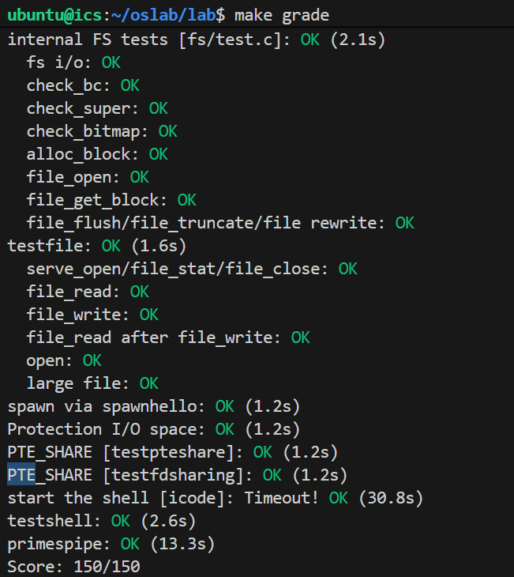

# Lab 5: File system, Spawn and Shell

## Challenge 
Challenge! The block cache has no eviction policy. Once a block gets faulted in to it, it never gets removed and will remain in memory forevermore. Add eviction to the buffer cache. Using the `PTE_A` "accessed" bits in the page tables, which the hardware sets on any access to a page, you can track approximate usage of disk blocks without the need to modify every place in the code that accesses the disk map region. Be careful with dirty blocks.

时钟算法 (Clock Algorithm)

我们将所有的磁盘块缓存页看作一个环形列表。我们需要一个指针（`hand`）指向当前检查的页面。

当需要驱逐一个页面时，我们从`hand`开始扫描：

1. 检查当前页面的`PTE_A`(Accessed) 位：
	1. 如果`PTE_A`是 1：说明这个页面最近被访问过，它是“有用”的。我们给它第二次机会：
		1. 清除`PTE_A`位（将其置为 0）。
		2. 如果页面是脏的（`PTE_D` 为 1），最好顺便把它刷回磁盘（Flush），变成干净的页面，以便下次更容易驱逐。
		3. 移动`hand`指针到下一页，继续寻找。
	2. 如果`PTE_A`是 0：说明这个页面最近没有被访问，它是受害者（Victim）。
		1. 如果页面是脏的（PTE_D 为 1），必须先刷回磁盘（Flush）。
		2. 卸载（Unmap）这个页面，释放物理内存。
		3. 移动`hand`指针，并返回（驱逐完成）。


`fs/bc.c`
```c
static void
evict_block(void)
{
    static uint32_t hand = 0;
    
    while (1) {
        void *va = diskaddr(hand);

        // 如果整个页表都不存在，可以直接跳过 1024 个块 (PTSIZE/BLKSIZE)
        if (!(uvpd[PDX(va)] & PTE_P)) {
            hand = (hand + PTSIZE / BLKSIZE) & ~(PTSIZE / BLKSIZE - 1);
            if (hand >= DISKSIZE / BLKSIZE) hand = 0;
            continue;
        }

        // 检查页表项 (PTE) 是否存在 (即块是否在缓存中)
        if (uvpt[PGNUM(va)] & PTE_P) {
            uint32_t pte = uvpt[PGNUM(va)];
            // 情况 1: 页面被访问过 (PTE_A == 1) -> 给第二次机会
            if (pte & PTE_A) {
                if (pte & PTE_D) {
                    flush_block(va); 
                } else {
                    sys_page_map(0, va, 0, va, pte & PTE_SYSCALL);
                }
            } 
            // 情况 2: 页面未被访问 (PTE_A == 0) -> 驱逐
            else {
                if (pte & PTE_D) {
                    flush_block(va); // 脏页必须先写回
                }
                sys_page_unmap(0, va); // 释放内存
                
                hand = (hand + 1) % (DISKSIZE / BLKSIZE);
                return;
            }
        }

        hand = (hand + 1) % (DISKSIZE / BLKSIZE);
    }
}


```c
static void
bc_pgfault(struct UTrapframe *utf)
{
	...
	// LAB 5: you code here:
	addr = ROUNDDOWN(addr, PGSIZE);
	if ((r = sys_page_alloc(0, addr, PTE_P|PTE_U|PTE_W)) < 0) {
		if (r == -E_NO_MEM) {
            evict_block();
            // 再次尝试分配
            if ((r = sys_page_alloc(0, addr, PTE_P|PTE_U|PTE_W)) < 0)
                panic("in bc_pgfault, sys_page_alloc after evict: %e", r);
        } else {
            panic("in bc_pgfault, sys_page_alloc: %e", r);
        }
	}
	...
}
```
## Setup
merge lab4后编译出现报错
```bash
lib/spawn.c: In function ‘spawn’:
lib/spawn.c:110:35: error: taking address of packed member of ‘struct Trapframe’ may result in an unaligned pointer value [-Werror=address-of-packed-member]
  110 |  if ((r = init_stack(child, argv, &child_tf.tf_esp)) < 0)
      |                                   ^~~~~~~~~~~~~~~~
cc1: all warnings being treated as errors
make: *** [lib/Makefrag:37: obj/lib/spawn.o] Error 1
```
修改`GNUmakefile`增加以下行即可
```cmake
CFLAGS += -Wno-error=address-of-packed-member
```

## File system preliminaries
creating, reading, writing, and deleting files organized in a hierarchical directory structure

a single-user operating system, which provides protection sufficient to catch bugs but not to protect multiple mutually suspicious users from each other

does not support the UNIX notions of file ownership or permissions

does not support hard links, symbolic links, time stamps, or special device files like most UNIX file systems do

our file system will not use inodes at all and instead will simply store all of a file's (or sub-directory's) meta-data within the (one and only) directory entry describing that file

sector size is a property of the disk hardware, whereas block size is an aspect of the operating system using the disk

## The File System
you will be responsible for reading blocks into the block cache and flushing them back to disk; allocating disk blocks; mapping file offsets to disk blocks; and implementing read, write, and open in the IPC interface

### Disk Access
In effect, the IOPL bits in the EFLAGS register provides the kernel with a simple "all-or-nothing" method of controlling whether user-mode code can access I/O space. In our case, we want the file system environment to be able to access I/O space, but we do not want any other environments to be able to access I/O space at all.
#### Exercise 1
`i386_init` identifies the file system environment by passing the type `ENV_TYPE_FS` to your environment creation function, `env_create`. Modify `env_create` in `env.c`, so that it gives the file system environment I/O privilege, but never gives that privilege to any other environment.

Make sure you can start the file environment without causing a General Protection fault. You should pass the "fs i/o" test in `make grade`.
#### Answer
```c
void
env_create(uint8_t *binary, enum EnvType type)
{
  ...
	// LAB 5: Your code here.
	if (type == ENV_TYPE_FS)
		newenv->env_tf.tf_eflags |= FL_IOPL_3;
}
```

#### Question 1
Do you have to do anything else to ensure that this I/O privilege setting is saved and restored properly when you subsequently switch from one environment to another? Why?

#### Answer
不需要额外的操作了，因为ELAGS作为每个环境的`Trapframe`的一部分，在上下文切换时会自动被压入内核栈从而下次切换回来时会正确保存。
### The Block Cache

We reserve a large, fixed 3GB region of the file system environment's address space, from `0x10000000` (`DISKMAP`) up to `0xD0000000` (`DISKMAP+DISKMAX`), as a "memory mapped" version of the disk. For example, disk block 0 is mapped at virtual address `0x10000000`, disk block 1 is mapped at virtual address `0x10001000`, and so on.

block size of 4096 bytes

#### Exercise 2
Implement the `bc_pgfault` and `flush_block` functions in `fs/bc.c`. `bc_pgfault` is a page fault handler, just like the one your wrote in the previous lab for copy-on-write fork, except that its job is to load pages in from the disk in response to a page fault. When writing this, keep in mind that (1) `addr` may not be aligned to a block boundary and (2) `ide_read` operates in sectors, not blocks.

The `flush_block` function should write a block out to disk if necessary. `flush_block` shouldn't do anything if the block isn't even in the block cache (that is, the page isn't mapped) or if it's not dirty. We will use the VM hardware to keep track of whether a disk block has been modified since it was last read from or written to disk. To see whether a block needs writing, we can just look to see if the `PTE_D` "dirty" bit is set in the uvpt entry. (The `PTE_D` bit is set by the processor in response to a write to that page; see 5.2.4.3 in chapter 5 of the 386 reference manual.) After writing the block to disk, `flush_block` should clear the `PTE_D` bit using `sys_page_map`.

Use `make grade` to test your code. Your code should pass "check_bc", "check_super", and "check_bitmap".

#### Answer

```c
static void
bc_pgfault(struct UTrapframe *utf)
{
	...
	// LAB 5: you code here:
	addr = ROUNDDOWN(addr, PGSIZE);
	if ((r = sys_page_alloc(0, addr, PTE_P|PTE_U|PTE_W)) < 0)
		panic("in bc_pgfault, sys_page_alloc: %e", r);
	if ((r = ide_read(blockno * BLKSECTS, addr, BLKSECTS)) < 0)
		panic("in bc_pgfault, ide_read: %e", r);
	...
}
```

```c
void
flush_block(void *addr)
{
  ...
	// LAB 5: Your code here.
	addr = ROUNDDOWN(addr, PGSIZE);
	if (!va_is_mapped(addr))
		return;
	if (!va_is_dirty(addr))
		return;
	int r;
	if ((r = ide_write(blockno * BLKSECTS, addr, BLKSECTS)) < 0)
		panic("in flush_block, ide_write: %e", r);
	// Clear the dirty bit for the disk block page since we just wrote the
	// block to disk
	if ((r = sys_page_map(0, addr, 0, addr, uvpt[PGNUM(addr)] & PTE_SYSCALL)) < 0)
		panic("in flush_block, sys_page_map: %e", r);
}
```

### The Block Bitmap
#### Exercise 3
Use `free_block` as a model to implement `alloc_block` in `fs/fs.c`, which should find a free disk block in the bitmap, mark it used, and return the number of that block. When you allocate a block, you should immediately flush the changed bitmap block to disk with flush_block, to help file system consistency.

Use `make grade` to test your code. Your code should now pass "alloc_block".

#### Answer
```c
int
alloc_block(void)
{
	// LAB 5: Your code here.
	for (uint32_t blockno = 2; blockno < super->s_nblocks; blockno++) {
		if (block_is_free(blockno)) {
			// Mark the block as used
			bitmap[blockno / 32] &= ~(1 << (blockno % 32));
			// Flush the bitmap block to disk
			flush_block(&bitmap[(blockno / 32)]);
			return blockno;
		}
	}
	// panic("alloc_block not implemented");
	return -E_NO_DISK;
}
```

### File Operations

#### Exercise 4
Implement `file_block_walk` and `file_get_block`. `file_block_walk` maps from a block offset within a file to the pointer for that block in the `struct File` or the indirect block, very much like what `pgdir_walk` did for page tables. `file_get_block` goes one step further and maps to the actual disk block, allocating a new one if necessary.

Use `make grade` to test your code. Your code should pass "file_open", "file_get_block", and "file_flush/file_truncated/file rewrite", and "testfile".

### The file system interface
#### Exercise 5
Implement `serve_read` in `fs/serv.c`.

`serve_read`'s heavy lifting will be done by the already-implemented `file_read` in `fs/fs.c` (which, in turn, is just a bunch of calls to `file_get_block`). `serve_read` just has to provide the RPC interface for file reading. Look at the comments and code in `serve_set_size` to get a general idea of how the server functions should be structured.

Use `make grade` to test your code. Your code should pass "serve_open/file_stat/file_close" and "file_read" for a score of 70/150.

#### Answer
```c
int
serve_read(envid_t envid, union Fsipc *ipc)
{
	struct Fsreq_read *req = &ipc->read;
	struct Fsret_read *ret = &ipc->readRet;

	if (debug)
		cprintf("serve_read %08x %08x %08x\n", envid, req->req_fileid, req->req_n);

	// Lab 5: Your code here:
	struct OpenFile *o;
	int r;
	// First, use openfile_lookup to find the relevant open file.
	// On failure, return the error code to the client with ipc_send.
	if ((r = openfile_lookup(envid, req->req_fileid, &o)) < 0)
		return r;
	// Second, call the relevant file system function (from fs/fs.c).
	// On failure, return the error code to the client.
	int count = file_read(o->o_file, ret->ret_buf, req->req_n, o->o_fd->fd_offset);
	if (count < 0)
		return count;
	// Third, update any relevant state.
	o->o_fd->fd_offset += count;
	return count;
}
```
#### Exercise 6
Implement `serve_write` in `fs/serv.c` and `devfile_write` in `lib/file.c`.

Use `make grade` to test your code. Your code should pass "file_write", "file_read after file_write", "open", and "large file" for a score of 90/150.
#### Answer
```c
int
serve_write(envid_t envid, struct Fsreq_write *req)
{
	if (debug)
		cprintf("serve_write %08x %08x %08x\n", envid, req->req_fileid, req->req_n);
	// LAB 5: Your code here.
	struct OpenFile *o;
	int r;
	if ((r = openfile_lookup(envid, req->req_fileid, &o)) < 0)
		return r;
	int count = file_write(o->o_file, req->req_buf, req->req_n, o->o_fd->fd_offset);
	if (count < 0)
		return count;
	o->o_fd->fd_offset += count;
	return count;
}
```

```c
static ssize_t
devfile_write(struct Fd *fd, const void *buf, size_t n)
{
	// LAB 5: Your code here
	int r;

	fsipcbuf.write.req_fileid = fd->fd_file.id;
	fsipcbuf.write.req_n = n;
	memmove(fsipcbuf.write.req_buf, buf, n);
	if ((r = fsipc(FSREQ_WRITE, NULL)) < 0)
		return r;
	assert(r <= n);
	assert(r <= PGSIZE - (sizeof(int) + sizeof(size_t)));
	return r;
}
```
## Spawning Processes
creates a new environment, loads a program image from the file system into it, and then starts the child environment running this program

#### Exercise 7
`spawn` relies on the new syscall `sys_env_set_trapframe` to initialize the state of the newly created environment. Implement `sys_env_set_trapframe` in `kern/syscall.c` (don't forget to dispatch the new system call in `syscall()`).

Test your code by running the `user/spawnhello` program from `kern/init.c`, which will attempt to spawn `/hello` from the file system.

Use `make grade` to test your code.

#### Answer
```c
static int
sys_env_set_trapframe(envid_t envid, struct Trapframe *tf)
{
	// LAB 5: Your code here.
	// Remember to check whether the user has supplied us with a good
	// address!
	struct Env *env;
	int ret = envid2env(envid, &env, 1);
	if (ret < 0) {
		return ret;
	}
	user_mem_assert(env, tf, sizeof(struct Trapframe), PTE_U);
	env->env_tf = *tf;
	// Ensure that the environment runs at CPL 3 with interrupts enabled
	env->env_tf.tf_eflags |= FL_IF;
	env->env_tf.tf_eflags &= ~FL_IOPL_MASK;
	env->env_tf.tf_cs |= 3;
	env->env_tf.tf_ss |= 3;
	return 0;
}
```
### Sharing library state across fork and spawn

#### Exercise 8
Change `duppage` in `lib/fork.c` to follow the new convention. If the page table entry has the `PTE_SHARE` bit set, just copy the mapping directly. (You should use `PTE_SYSCALL`, not `0xfff`, to mask out the relevant bits from the page table entry. `0xfff` picks up the accessed and dirty bits as well.)

Likewise, implement `copy_shared_pages` in `lib/spawn.c`. It should loop through all page table entries in the current process (just like `fork` did), copying any page mappings that have the `PTE_SHARE` bit set into the child process.

#### Answer
```c
static int
duppage(envid_t envid, unsigned pn)
{
	...
	if (pte & PTE_SHARE) {
		// Shared page: map it directly.
		r = sys_page_map(0, addr, envid, addr, pte & PTE_SYSCALL);
		if (r < 0) {
			panic("duppage: sys_page_map failed: %e", r);
		}
		return 0;
	}
	...
}
```

```c
static int
copy_shared_pages(envid_t child)
{
	// LAB 5: Your code here.
	uint32_t i, perm;
	for (i = 0; i < UTOP; i += PGSIZE) {
		if (!(uvpd[PDX(i)] & PTE_P))
			continue;
		if (!(uvpt[PGNUM(i)] & PTE_SHARE))
			continue;
		perm = uvpt[PGNUM(i)] & PTE_SYSCALL;
		if (sys_page_map(0, (void*)i, child, (void*)i, perm) < 0)
			return -E_NO_MEM;
	}
	return 0;
}
```

## The keyboard interface

#### Exercise 9
In your `kern/trap.c`, call `kbd_intr` to handle trap `IRQ_OFFSET+IRQ_KBD` and `serial_intr` to handle trap `IRQ_OFFSET+IRQ_SERIAL`.

#### Answer
```c
if (tf->tf_trapno == IRQ_OFFSET + IRQ_KBD) {
	kbd_intr();
	return;
}
if (tf->tf_trapno == IRQ_OFFSET + IRQ_SERIAL) {
	serial_intr();
	return;
}
```
## The Shell
#### Exercise 10

The shell doesn't support I/O redirection. It would be nice to run `sh <script` instead of having to type in all the commands in the script by hand, as you did above. Add I/O redirection for < to `user/sh.c`.

Test your implementation by typing `sh <script` into your shell

Run make `run-testshell` to test your shell. `testshell` simply feeds the above commands (also found in `fs/testshell.sh`) into the shell and then checks that the output matches `fs/testshell.key`.

#### Answer
```c
case '<':	// Input redirection
	// Grab the filename from the argument list
	if (gettoken(0, &t) != 'w') {
		cprintf("syntax error: < not followed by word\n");
		exit();
	}
	// LAB 5: Your code here.
	if ((fd = open(t, O_RDONLY)) < 0) {
		cprintf("open %s for read: %e", t, fd);
		exit();
	}
	if (fd != 0) {
		dup(fd, 0);
		close(fd);
	}
	// panic("< redirection not implemented");
	break;
```

